# Flat2VR Index

Every flatscreen game you can play in VR, and the port that does it, on PCVR and standalone headsets.

**Submit or update a port:** see [CONTRIBUTING.md](CONTRIBUTING.md).

<!-- INDEX:START (generated by scripts/build.mjs, do not edit) -->

| Game | Port | Platform | Status | Latest | Author | Reviews |
|---|---|---|---|---|---|---|
|  **007 First Light** | [007 First Light R.E.A.L. VR](https://www.patreon.com/realvr/posts/bond-159956522) | PCVR | 🚧 beta | [unversioned](https://www.patreon.com/realvr/posts/bond-159956522) 2026-06-02 | Luke Ross | [▶ NotAGameAddict](https://www.youtube.com/watch?v=bkY1nSzsIW8) [▶ YouGotColdYogurt](https://www.youtube.com/watch?v=qlWP_YPt76c) |
|  **ACE COMBAT 8** | [ACE COMBAT 8 UEVR Profile (HUD fix)](https://github.com/VTFLAB/ace-combat-8-uevr-profile) | PCVR | ✅ stable 1 known bug | [v1.0.0](https://github.com/VTFLAB/ace-combat-8-uevr-profile/releases/latest) 2026-10-04 | [VTFLAB](https://github.com/VTFLAB) | [▶ Paradise Decay](https://www.youtube.com/watch?v=weAhEMpT87k) [▶ NotAGameAddict](https://www.youtube.com/watch?v=spKprOsBkN8) |
|  **Animal Crossing (GameCube)** | [Animal Crossing VR/MR Standalone](https://github.com/heurazy/AnimalCrossing-VR-MR-Standalone) | Standalone | 🚧 beta | [v1.0.2](https://github.com/heurazy/AnimalCrossing-VR-MR-Standalone/releases/latest) 2026-08-11 | [heurazy](https://github.com/heurazy) | — |
|  **Assassin's Creed IV: Black Flag** | [Assassin's Creed IV: Black Flag Resynced VR](https://www.patreon.com/NoMoreFlat/posts/assassins-creed-164150917) | PCVR | 🚧 beta 3 known bugs | [unversioned](https://www.patreon.com/NoMoreFlat/posts/assassins-creed-164150917) 2026-07-18 | Mutar / NoMoreFlat | [▶ BrothersGanes](https://www.youtube.com/watch?v=rlLao3Q6tvg) |
|  **Assassin's Creed Origins** | [Assassin's Creed Origins VR](https://www.patreon.com/NoMoreFlat/posts/assasins-creed-164608087) | PCVR | 🚧 beta 1 known bug | [unversioned](https://www.patreon.com/NoMoreFlat/posts/assasins-creed-164608087) 2026-07-23 | Mutar, NoMoreFlat | [▶ THEGAMEVEDA](https://www.youtube.com/watch?v=OFwRzPdAaHM) [▶ Techno Tamizha](https://www.youtube.com/watch?v=M1OoTOAHWOA) |
|  **Bendy and the Ink Machine** | [BendyVR](https://github.com/Team-Beef-Studios/BendyVR) | PCVR | ✅ stable | [v.1.2.2](https://github.com/Team-Beef-Studios/BendyVR/releases/latest) 2024-07-13 | [Team Beef](https://github.com/Team-Beef-Studios) | [▶ 99TH VR](https://www.youtube.com/watch?v=EsnSDiytst8) [▶ Vano](https://www.youtube.com/watch?v=FjC5Rnk_cOs) |
| 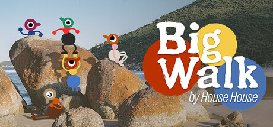 **Big Walk** | [Big Walk VR](https://github.com/CircuitLord/CircuitLordVRModInstaller) | PCVR | ✅ stable | [v1.2.9](https://github.com/CircuitLord/CircuitLordVRModInstaller/releases/latest/download/CircuitLordVRModInstaller.exe) 2026-10-06 | [CircuitLord](https://github.com/CircuitLord) | [▶ BamBaeYoh](https://www.youtube.com/watch?v=SXSZO6CctfM) [▶ Sk0l](https://www.youtube.com/watch?v=zMMNyRHrgBg) |
| 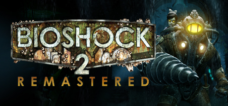 **BioShock 2 Remastered** | [BioShock VR](https://github.com/VR-Stereo-Hub/bioshock-trilogy-vr) | PCVR | 🧪 alpha 2 known bugs | [v0.8.3](https://github.com/VR-Stereo-Hub/bioshock-trilogy-vr/releases/latest) 2026-09-10 | [VR-Stereo-Hub](https://github.com/VR-Stereo-Hub) | [▶ Beardo Benjo](https://www.youtube.com/watch?v=4vC_-AKmVeA) [▶ Beardo Benjo](https://www.youtube.com/watch?v=s5XfXX5xpsA) |
|  **BioShock Infinite** | [BioShock VR](https://github.com/VR-Stereo-Hub/bioshock-trilogy-vr) | PCVR | 🧪 alpha 2 known bugs | [v0.8.3](https://github.com/VR-Stereo-Hub/bioshock-trilogy-vr/releases/latest) 2026-09-10 | [VR-Stereo-Hub](https://github.com/VR-Stereo-Hub) | [▶ Beardo Benjo](https://www.youtube.com/watch?v=4vC_-AKmVeA) [▶ Beardo Benjo](https://www.youtube.com/watch?v=s5XfXX5xpsA) |
|  **BioShock Remastered** | [BioShock Remastered VR](https://github.com/BioVRDev/Bioshock-Remastered-VR) | PCVR | ✅ stable | [v1.0.3a](https://github.com/BioVRDev/Bioshock-Remastered-VR/releases/latest) 2026-08-14 | [BioVRDev](https://github.com/BioVRDev), Pizzzaparker | [▶ Mac In VR](https://www.youtube.com/watch?v=QKVw10Tt_2c) [▶ VoodooDE VR - english version -](https://www.youtube.com/watch?v=QH5imGj8PjE) |
| 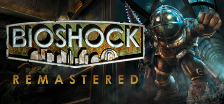 **BioShock Remastered** | [BioShock VR](https://github.com/VR-Stereo-Hub/bioshock-trilogy-vr) | PCVR | 🧪 alpha 2 known bugs | [v0.8.3](https://github.com/VR-Stereo-Hub/bioshock-trilogy-vr/releases/latest) 2026-09-10 | [VR-Stereo-Hub](https://github.com/VR-Stereo-Hub) | [▶ Beardo Benjo](https://www.youtube.com/watch?v=4vC_-AKmVeA) [▶ Beardo Benjo](https://www.youtube.com/watch?v=s5XfXX5xpsA) |
|  **Blood** | [RazeXR](https://github.com/Team-Beef-Studios/RazeXR) | Standalone | ✅ stable | [v1.0.0](https://github.com/Team-Beef-Studios/RazeXR/releases/latest) 2023-09-30 | [Team Beef](https://github.com/Team-Beef-Studios) | [▶ VR Reviews](https://www.youtube.com/watch?v=dFiVi_xUjRc) [▶ VoodooDE VR](https://www.youtube.com/watch?v=h5vjhgyeNiE) |
|  **Call of Duty 4: Modern Warfare** | [KisakCOD VR WinlatorXR](https://github.com/SgtBilko76/CallOfDuty4_VR_WinlatorXR) | Standalone | 🚧 beta 4 known bugs | [v0.1.0-beta.1](https://github.com/SgtBilko76/CallOfDuty4_VR_WinlatorXR/releases/latest) 2026-09-20 | [SgtBilko76](https://github.com/SgtBilko76), jplakon, SwagSoftware | [▶ NotAGameAddict](https://www.youtube.com/watch?v=NlR_JheVXCk) |
|  **Call of Duty 4: Modern Warfare (2007)** | [KisakCOD VR](https://github.com/jplakon/CallOfDuty4_VR) | PCVR | 🚧 beta 3 known bugs | [v0.10.0-beta.19](https://github.com/jplakon/CallOfDuty4_VR/releases/latest) 2026-09-23 | JplayUltimate, [jplakon](https://github.com/jplakon) | [▶ NotAGameAddict](https://www.youtube.com/watch?v=NlR_JheVXCk) [▶ StrainZex](https://www.youtube.com/watch?v=IfMoMmu5rhA) |
|  **Control** | [Control VR](https://www.patreon.com/NoMoreFlat/posts/control-vr-dev-161743534) | PCVR | 🚧 beta 2 known bugs | [unversioned](https://www.patreon.com/NoMoreFlat/posts/control-vr-dev-161743534) 2026-07-02 | Mutar (NoMoreFlat) | [▶ Kory & Brooke](https://www.youtube.com/watch?v=6DJ01fHF8Sc) [▶ PowerOnVR](https://www.youtube.com/watch?v=0rXO54K3iYM) |
| 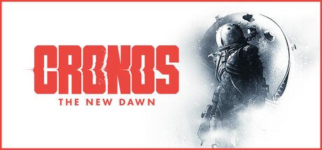 **Cronos: The New Dawn** | [Cronos: The New Dawn UEVR](https://github.com/letmein-vr/CRONOS_UEVR) | PCVR | ✅ stable 2 known bugs | [1.2](https://github.com/letmein-vr/CRONOS_UEVR/releases/latest) 2026-08-01 | [letmein-vr](https://github.com/letmein-vr) | [▶ Paradise Decay](https://www.youtube.com/watch?v=0bOrTZ69bbQ) [▶ NotAGameAddict](https://www.youtube.com/watch?v=XMWrEvKC7QU) |
| 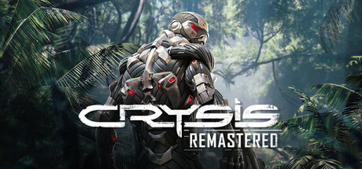 **Crysis** | [Crysis VR WinlatorXR](https://github.com/SgtBilko76/Crysis-VR-WinlatorXR) | Standalone | 🚧 beta | [Beta-0.3](https://github.com/SgtBilko76/Crysis-VR-WinlatorXR/releases/latest) 2026-09-16 | [SgtBilko76](https://github.com/SgtBilko76), fholger | [▶ Parzival_VR_EN](https://www.youtube.com/watch?v=cwGWHTBZ5SU) [▶ Louie's VR Corner](https://www.youtube.com/watch?v=X362mNKhA7U) |
|  **Cyberpunk 2077** | [CyberpunkVR Port](https://github.com/dariulone/cyberpunk-vr-port) | PCVR | 🚧 beta | [0.1.7](https://github.com/dariulone/cyberpunk-vr-port/releases/latest) 2026-09-29 | [dariulone](https://github.com/dariulone) | [▶ Beardo Benjo](https://www.youtube.com/watch?v=bqWALEvZ1to) [▶ Beardo Benjo](https://www.youtube.com/watch?v=XkzaBRPJoQE) |
| 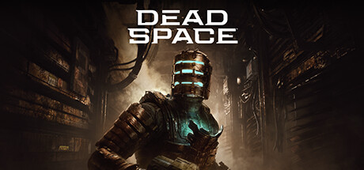 **Dead Space (2023)** | [Dead Space (2023) R.E.A.L. VR](https://www.patreon.com/realvr/posts/ds2023-165285354) | PCVR | 🚧 beta | [2607.31.2](https://www.patreon.com/realvr/posts/ds2023-165285354) 2026-07-31 | Luke Ross | [▶ Beardo Benjo](https://www.youtube.com/watch?v=i8kqEA6QuM4) [▶ Beardo Benjo](https://www.youtube.com/watch?v=lvCuaE87zS0) |
| 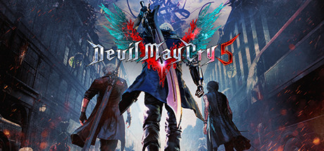 **Devil May Cry 5** | [REFramework](https://github.com/praydog/REFramework) | PCVR | ✅ stable | [v1.5.9.1](https://github.com/praydog/REFramework/releases/latest) 2025-03-05 | [praydog](https://github.com/praydog) | [▶ MRTV - MIXED REALITY TV](https://www.youtube.com/watch?v=hySd4sHtcDE) [▶ Stereo3DProductions](https://www.youtube.com/watch?v=Ql5ggETipyM) |
| 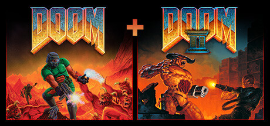 **Doom** | [QuestZDoom](https://github.com/Team-Beef-Studios/QuestZDoom) | Standalone | ✅ stable | [1.6.2](https://github.com/Team-Beef-Studios/QuestZDoom/releases/latest) 2026-09-30 | [Team Beef](https://github.com/Team-Beef-Studios) | [▶ Beardo Benjo](https://www.youtube.com/watch?v=YelM8MdzzpI) [▶ VR Reviews](https://www.youtube.com/watch?v=LwT1aKRGcOA) |
| 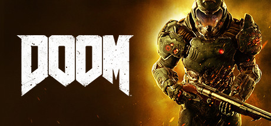 **DOOM (2016)** | [DOOM (2016) R.E.A.L. VR](https://www.patreon.com/realvr/posts/doom-162879153) | PCVR | 🚧 beta | [2607.31.1](https://www.patreon.com/realvr/posts/doom-162879153) 2026-07-04 | Luke Ross | [▶ Beardo Benjo](https://www.youtube.com/watch?v=rf1aWozpwK0) [▶ Gamertag VR](https://www.youtube.com/watch?v=5BCafGSVhN0) |
| 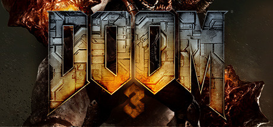 **Doom 3** | [Doom3Quest](https://github.com/Team-Beef-Studios/Doom3Quest) | Standalone | ✅ stable | [v1.4.8](https://github.com/Team-Beef-Studios/Doom3Quest/releases/latest) 2026-09-30 | [Team Beef](https://github.com/Team-Beef-Studios) | [▶ Team Beef VR Game Ports](https://www.youtube.com/watch?v=y2y9C0E2kPk) [▶ Gamertag VR](https://www.youtube.com/watch?v=U4aRzfja8xg) |
| 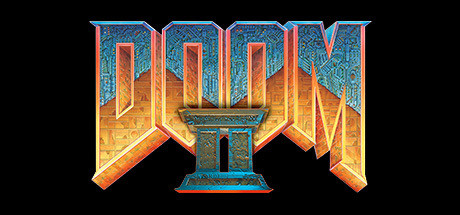 **Doom II** | [QuestZDoom](https://github.com/Team-Beef-Studios/QuestZDoom) | Standalone | ✅ stable | [1.6.2](https://github.com/Team-Beef-Studios/QuestZDoom/releases/latest) 2026-09-30 | [Team Beef](https://github.com/Team-Beef-Studios) | [▶ Beardo Benjo](https://www.youtube.com/watch?v=YelM8MdzzpI) [▶ VR Reviews](https://www.youtube.com/watch?v=LwT1aKRGcOA) |
|  **Duke Nukem 3D** | [RazeXR](https://github.com/Team-Beef-Studios/RazeXR) | Standalone | ✅ stable | [v1.0.0](https://github.com/Team-Beef-Studios/RazeXR/releases/latest) 2023-09-30 | [Team Beef](https://github.com/Team-Beef-Studios) | [▶ VR Reviews](https://www.youtube.com/watch?v=dFiVi_xUjRc) [▶ VoodooDE VR](https://www.youtube.com/watch?v=h5vjhgyeNiE) |
| 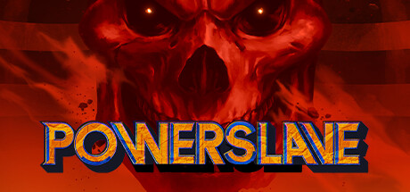 **Exhumed** | [RazeXR](https://github.com/Team-Beef-Studios/RazeXR) | Standalone | ✅ stable | [v1.0.0](https://github.com/Team-Beef-Studios/RazeXR/releases/latest) 2023-09-30 | [Team Beef](https://github.com/Team-Beef-Studios) | [▶ VR Reviews](https://www.youtube.com/watch?v=dFiVi_xUjRc) [▶ VoodooDE VR](https://www.youtube.com/watch?v=h5vjhgyeNiE) |
| 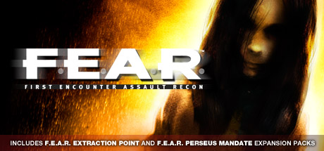 **F.E.A.R.** | [F.E.A.R. VR](https://github.com/DR-89/fear-vr) | PCVR | 🚧 beta | [v1.0.0-beta.8](https://github.com/DR-89/fear-vr/releases/latest) 2026-08-04 | [DR-89](https://github.com/DR-89) | [▶ TheFreeMike](https://www.youtube.com/watch?v=mIsvNvWRc-w) [▶ TheFreeMike](https://www.youtube.com/watch?v=LHwgHBhKbjE) |
| 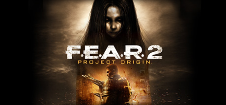 **F.E.A.R. 2: Project Origin** | [FEAR2VR](https://github.com/praydog/FEAR2VR) | PCVR | 🧪 alpha | [unversioned](https://github.com/praydog/FEAR2VR) 2026-08-09 | [Praydog](https://github.com/praydog) | — |
|  **Firewatch** | [Two Forks VR](https://github.com/Raicuparta/two-forks-vr) | PCVR | ✅ stable | [v2.1.0](https://github.com/Raicuparta/two-forks-vr/releases/latest) 2022-08-19 | [Raicuparta](https://raicuparta.com) | [▶ VoodooDE VR](https://www.youtube.com/watch?v=aIAuiCtT9Lw) [▶ VoodooDE VR - english version -](https://www.youtube.com/watch?v=lrqEuM8T8xc) |
|  **Forza Horizon 5** | [Forza VRMod](https://github.com/oofz/vrmod-releases) | PCVR | 🚧 beta | [v1.4.2](https://github.com/oofz/vrmod-releases/releases/latest) 2026-09-08 | lufz, [oofz](https://github.com/oofz) | [▶ SimplyPops](https://www.youtube.com/watch?v=D3vgxYuoxr8) [▶ coolkidfrmbx](https://www.youtube.com/watch?v=--EgpTztmxw) |
|  **Forza Horizon 6** | [Forza VRMod](https://github.com/oofz/vrmod-releases) | PCVR | 🚧 beta | [v1.4.2](https://github.com/oofz/vrmod-releases/releases/latest) 2026-09-08 | lufz, [oofz](https://github.com/oofz) | [▶ SimplyPops](https://www.youtube.com/watch?v=D3vgxYuoxr8) [▶ coolkidfrmbx](https://www.youtube.com/watch?v=--EgpTztmxw) |
|  **Grand Theft Auto IV** | [Grand Theft Auto IV VR](https://github.com/Hochgeschwindigkeitsrennfahrer/Grand-Theft-Auto-IV-VR-Mod) | PCVR | 🧪 alpha 2 known bugs | [GTA4VR](https://github.com/Hochgeschwindigkeitsrennfahrer/Grand-Theft-Auto-IV-VR-Mod/releases/latest) 2026-08-04 | [Hochgeschwindigkeitsrennfahrer](https://github.com/Hochgeschwindigkeitsrennfahrer) | [▶ NotAGameAddict](https://www.youtube.com/watch?v=qJbdckHlBmM) [▶ MrIch325](https://www.youtube.com/watch?v=JkVdSyDpg78) |
|  **Grand Theft Auto: San Andreas - The Definitive Edition** | [SAN ANDREAS VR DEFINITIVE EDITION](https://github.com/Gangbusters1337/SAN-ANDREAS-VR-DEFINITIVE-EDITION) | PCVR | 🚧 beta | [v0.3.7](https://github.com/Gangbusters1337/SAN-ANDREAS-VR-DEFINITIVE-EDITION/releases/latest) 2026-09-09 | [Gangbusters1337](https://github.com/Gangbusters1337) | — |
|  **Grand Theft Auto: Vice City** | [Vice City VR](https://github.com/dubrovskiy-yevhen-stakelogic/vice-city-vr) | PCVR + Standalone | 🧪 alpha | [v0.5.5.1](https://github.com/dubrovskiy-yevhen-stakelogic/vice-city-vr/releases/latest) 2026-09-14 | dubrovskiy-yevhen-stakelogic | [▶ Vlad Yaps](https://www.youtube.com/watch?v=2e0IqwScrVk) [▶ Beyond Meta](https://www.youtube.com/watch?v=eEVMxo9YLLI) |
| 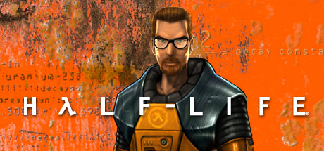 **Half-Life** | [Lambda1VR](https://github.com/Team-Beef-Studios/Lambda1VR) | Standalone | ✅ stable | [v1.7.4](https://github.com/Team-Beef-Studios/Lambda1VR/releases/latest) 2026-09-29 | [Team Beef](https://github.com/Team-Beef-Studios) | [▶ BMFVR](https://www.youtube.com/watch?v=A11e-h6qgDM) [▶ Matteo311](https://www.youtube.com/watch?v=5eRyhJwN1c0) |
|  **Half-Life 2** | [Half-Life 2: VR Mod](https://store.steampowered.com/app/658920/) | PCVR | ✅ stable | [Steam (auto-updates)](https://store.steampowered.com/app/658920/) 2023-04-06 | Source VR Mod Team | [▶ Bonezz](https://www.youtube.com/watch?v=z8LRyoxo7kQ) [▶ 99TH VR](https://www.youtube.com/watch?v=0X7h9nVNHX8) |
|  **Half-Life 2** | [SourceVR](https://github.com/tinsarfal/SourceVR) | Standalone | 🚧 beta | [0.1.28](https://github.com/tinsarfal/SourceVR/releases/latest) 2026-10-02 | [tinsarfal](https://github.com/tinsarfal) | [▶ LunchAndVR](https://www.youtube.com/watch?v=QzgDw8xEpeM) [▶ LunchAndVR](https://www.youtube.com/watch?v=kR_z39AJ-PQ) |
|  **Half-Life 2: Episode One** | [Half-Life 2: VR Mod](https://store.steampowered.com/app/658920/) | PCVR | ✅ stable | [Steam (auto-updates)](https://store.steampowered.com/app/658920/) 2023-04-06 | Source VR Mod Team | [▶ Bonezz](https://www.youtube.com/watch?v=z8LRyoxo7kQ) [▶ 99TH VR](https://www.youtube.com/watch?v=0X7h9nVNHX8) |
|  **Half-Life 2: Episode One** | [SourceVR](https://github.com/tinsarfal/SourceVR) | Standalone | 🚧 beta | [0.1.28](https://github.com/tinsarfal/SourceVR/releases/latest) 2026-10-02 | [tinsarfal](https://github.com/tinsarfal) | [▶ LunchAndVR](https://www.youtube.com/watch?v=QzgDw8xEpeM) [▶ LunchAndVR](https://www.youtube.com/watch?v=kR_z39AJ-PQ) |
| 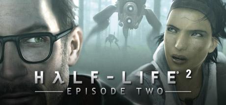 **Half-Life 2: Episode Two** | [Half-Life 2: VR Mod](https://store.steampowered.com/app/658920/) | PCVR | ✅ stable | [Steam (auto-updates)](https://store.steampowered.com/app/658920/) 2023-04-06 | Source VR Mod Team | [▶ Bonezz](https://www.youtube.com/watch?v=z8LRyoxo7kQ) [▶ 99TH VR](https://www.youtube.com/watch?v=0X7h9nVNHX8) |
|  **Half-Life 2: Episode Two** | [SourceVR](https://github.com/tinsarfal/SourceVR) | Standalone | 🚧 beta | [0.1.28](https://github.com/tinsarfal/SourceVR/releases/latest) 2026-10-02 | [tinsarfal](https://github.com/tinsarfal) | [▶ LunchAndVR](https://www.youtube.com/watch?v=QzgDw8xEpeM) [▶ LunchAndVR](https://www.youtube.com/watch?v=kR_z39AJ-PQ) |
|  **Halo: Campaign Evolved** | [Halo: Campaign Evolved UEVR](https://github.com/MOTYSHIZ/HaloCampaignEvolved_UEVR) | PCVR | 🧪 alpha | [v0.7.0](https://github.com/MOTYSHIZ/HaloCampaignEvolved_UEVR/releases/latest) 2026-10-06 | [MOTYSHIZ](https://github.com/MOTYSHIZ) | [▶ LunchAndVR](https://www.youtube.com/watch?v=rVQWN7DvcMA) [▶ ThisKory](https://www.youtube.com/watch?v=_XOhW_B2e6k) |
| 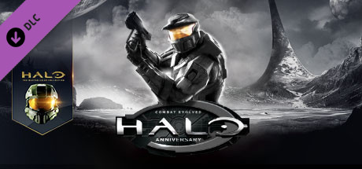 **Halo: Combat Evolved** | [Halo CE Quest VR + Android](https://github.com/moistman42069/HaloCE-Quest-VR) | Standalone | 🚧 beta | [v1.0.18](https://github.com/moistman42069/HaloCE-Quest-VR/releases/latest) 2026-10-08 | [moistman42069](https://github.com/moistman42069) | — |
|  **Heretic** | [QuestZDoom](https://github.com/Team-Beef-Studios/QuestZDoom) | Standalone | ✅ stable | [1.6.2](https://github.com/Team-Beef-Studios/QuestZDoom/releases/latest) 2026-09-30 | [Team Beef](https://github.com/Team-Beef-Studios) | [▶ Beardo Benjo](https://www.youtube.com/watch?v=YelM8MdzzpI) [▶ VR Reviews](https://www.youtube.com/watch?v=LwT1aKRGcOA) |
|  **Hexen** | [QuestZDoom](https://github.com/Team-Beef-Studios/QuestZDoom) | Standalone | ✅ stable | [1.6.2](https://github.com/Team-Beef-Studios/QuestZDoom/releases/latest) 2026-09-30 | [Team Beef](https://github.com/Team-Beef-Studios) | [▶ Beardo Benjo](https://www.youtube.com/watch?v=YelM8MdzzpI) [▶ VR Reviews](https://www.youtube.com/watch?v=LwT1aKRGcOA) |
|  **The House of the Dead 2** | [hotd2-vr](https://github.com/mikermak/hotd2-vr) | PCVR + Standalone | 🧪 alpha 2 known bugs | [v0.3-test1](https://github.com/mikermak/hotd2-vr/releases/latest) 2026-10-09 | [mikermak](https://github.com/mikermak) | [▶ Retroid](https://www.youtube.com/watch?v=A7b83PHgRB8) [▶ VR in EVERYTHING](https://www.youtube.com/watch?v=MkmQsxcIMLc) |
| 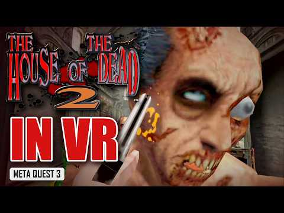 **The House of the Dead 2** | [The House of the Dead 2 VR](https://github.com/mikermak/hotd2-vr) | PCVR + Standalone | 🧪 alpha 2 known bugs | [v0.3-test1](https://github.com/mikermak/hotd2-vr/releases/latest) 2026-10-09 | [mikermak](https://github.com/mikermak) | [▶ Retroid](https://www.youtube.com/watch?v=A7b83PHgRB8) [▶ VR in EVERYTHING](https://www.youtube.com/watch?v=MkmQsxcIMLc) |
| 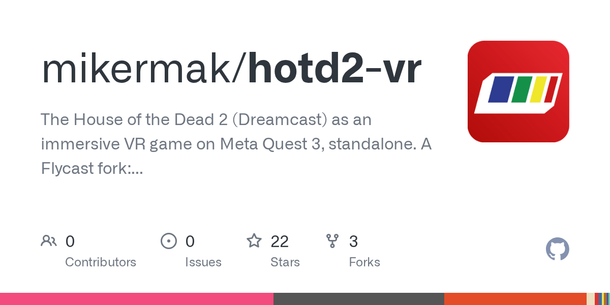 **The House of the Dead: The Maze of the Kings** | [hotd2-vr](https://github.com/mikermak/hotd2-vr) | PCVR + Standalone | 🧪 alpha 2 known bugs | [v0.3-test1](https://github.com/mikermak/hotd2-vr/releases/latest) 2026-10-09 | [mikermak](https://github.com/mikermak) | [▶ Retroid](https://www.youtube.com/watch?v=A7b83PHgRB8) [▶ VR in EVERYTHING](https://www.youtube.com/watch?v=MkmQsxcIMLc) |
| 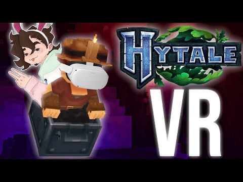 **Hytale** | [Hytale VR Injector](https://github.com/heurazy/HytaleVRInjector-mod) | PCVR | 🚧 beta | [v1.0.4](https://github.com/heurazy/HytaleVRInjector-mod/releases/latest) 2026-08-24 | [heurazy](https://github.com/heurazy) | [▶ Muntan](https://www.youtube.com/watch?v=Kg0P_mDJoTo) |
|  **IL-2 Sturmovik: 1946** | [IL-2 Sturmovik: 1946 VR](https://www.sas1946.com/main/index.php/topic,75791.0.html) | PCVR | 🧪 alpha | [unversioned](https://www.sas1946.com/main/index.php/topic,75791.0.html) 2026-08-09 | boilingMetal, firepolo | [▶ Xiao Wen](https://www.youtube.com/watch?v=MYpE9PPb49k) [▶ Xiao Wen](https://www.youtube.com/watch?v=MdMiA-GprkE) |
|  **Kingdom Come: Deliverance** | [KCD1VR](https://github.com/farmerarmor/KCD1VR) | PCVR | 🧪 alpha 6 known bugs | [v0.1.69](https://github.com/farmerarmor/KCD1VR/releases/latest) 2026-09-26 | [farmerarmor](https://github.com/farmerarmor) | [▶ Sweet Beans](https://www.youtube.com/watch?v=O1C_DT_P3oE) [▶ FastLawyer](https://www.youtube.com/watch?v=bEemOkchFGU) |
| 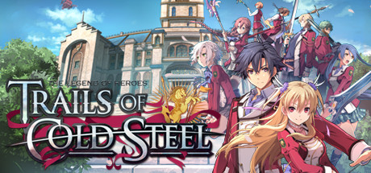 **The Legend of Heroes: Trails of Cold Steel** | [Trails of Cold Steel VR](https://github.com/petonexus/tocs-vr-releases) | PCVR | 🧪 alpha 1 known bug | [v0.1.0-alpha.3](https://github.com/petonexus/tocs-vr-releases/releases/latest) 2026-10-08 | [petonexus](https://github.com/petonexus) | — |
| 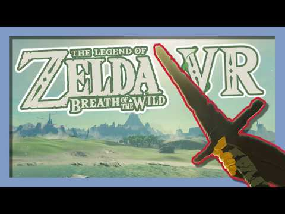 **The Legend of Zelda: Breath of the Wild** | [BetterVR](https://github.com/Crementif/BotW-BetterVR) | PCVR | 🚧 beta 4 known bugs | [0.9.23](https://github.com/Crementif/BotW-BetterVR/releases/latest) 2026-08-24 | [Crementif](https://github.com/Crementif) | [▶ GSpider Extras](https://www.youtube.com/watch?v=RiqP97-nGbw) [▶ Alexander Goncharov](https://www.youtube.com/watch?v=6usdDChC3xE) |
|  **Mario Kart Wii** | [WiiCompiled OpenXR VR](https://github.com/iChris4/Wiicompiled_VR) | PCVR | 🧪 alpha | [0.2.45](https://github.com/iChris4/Wiicompiled_VR/releases/latest) 2026-09-30 | [iChris4](https://github.com/iChris4) | [▶ Poofesure](https://www.youtube.com/watch?v=2D5KLLdZxPk) [▶ TWD98](https://www.youtube.com/watch?v=N0tQXO7d4YI) |
|  **Mario Kart Wii** | [Wiicompiled VR](https://github.com/iChris4/Wiicompiled_VR) | PCVR | 🧪 alpha 2 known bugs | [0.2.45](https://github.com/iChris4/Wiicompiled_VR/releases/latest) 2026-09-30 | [iChris4](https://github.com/iChris4) | [▶ Poofesure](https://www.youtube.com/watch?v=2D5KLLdZxPk) [▶ TWD98](https://www.youtube.com/watch?v=gQrwLvBTyN8) |
|  **Mass Effect (Legendary Edition)** | [Mass Effect Legendary Edition VR](https://www.patreon.com/dhalcyon/posts/suicide-mission-165506412) | PCVR | 🧪 alpha | [unversioned](https://www.patreon.com/dhalcyon/posts/suicide-mission-165506412) 2026-08-01 | dhalcyon | [▶ Beardo Benjo](https://www.youtube.com/watch?v=K-z0tIGgJag) [▶ Headset-VR](https://www.youtube.com/watch?v=tFHrf8v_uUY) |
| 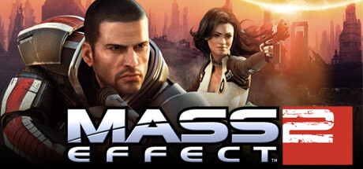 **Mass Effect 2 (Legendary Edition)** | [Mass Effect Legendary Edition VR](https://www.patreon.com/dhalcyon/posts/suicide-mission-165506412) | PCVR | 🧪 alpha | [unversioned](https://www.patreon.com/dhalcyon/posts/suicide-mission-165506412) 2026-08-01 | dhalcyon | [▶ Beardo Benjo](https://www.youtube.com/watch?v=K-z0tIGgJag) [▶ Headset-VR](https://www.youtube.com/watch?v=tFHrf8v_uUY) |
|  **The Maze of the Kings** | [The House of the Dead 2 VR](https://github.com/mikermak/hotd2-vr) | PCVR + Standalone | 🧪 alpha 2 known bugs | [v0.3-test1](https://github.com/mikermak/hotd2-vr/releases/latest) 2026-10-09 | [mikermak](https://github.com/mikermak) | [▶ Retroid](https://www.youtube.com/watch?v=A7b83PHgRB8) [▶ VR in EVERYTHING](https://www.youtube.com/watch?v=MkmQsxcIMLc) |
|  **Mega Man 64** | [MegaMan64RecompiledVR](https://github.com/randygil/MegaMan64RecompiledVR) | PCVR + Standalone | 🚧 beta | [v0.9.1-vr1](https://github.com/randygil/MegaMan64RecompiledVR/releases/latest) 2026-10-01 | [randygil](https://github.com/randygil) | — |
| 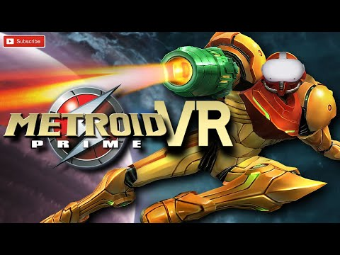 **Metroid Prime** | [PrimedGun](https://github.com/Nobbie248/PrimedGun) | PCVR + Standalone | ✅ stable 1 known bug | [v1.1.7-windows](https://github.com/Nobbie248/PrimedGun/releases/latest) 2026-10-05 | [Nobbie248](https://github.com/Nobbie248) | [▶ Beardo Benjo](https://www.youtube.com/watch?v=iWS_krcirCw) [▶ Beardo Benjo](https://www.youtube.com/watch?v=--05XNl9YaU) |
| 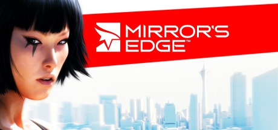 **Mirror's Edge (2008)** | [Mirror's Edge VR](https://github.com/letsgosportsteam/mirrors-edge-vr-mod) | PCVR | 🧪 alpha 3 known bugs | [v0.2.2-alpha](https://github.com/letsgosportsteam/mirrors-edge-vr-mod/releases/latest) 2026-09-19 | [LetsGoSportsTeam](https://github.com/letsgosportsteam) | — |
|  **Nuclear Option** | [NOVR](https://github.com/InfernoSuperNova/novr) | PCVR | 🚧 beta | [0.4.4](https://github.com/InfernoSuperNova/novr/releases/latest) 2026-09-09 | [InfernoSuperNova](https://github.com/InfernoSuperNova) | [▶ Enigma](https://www.youtube.com/watch?v=Ojqd0oC2c8U) [▶ TacJackal](https://www.youtube.com/watch?v=IDMlU4DRcRI) |
| 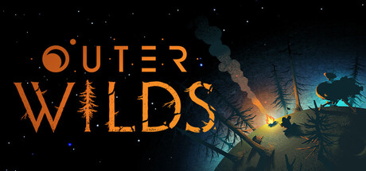 **Outer Wilds** | [NomaiVR](https://github.com/Raicuparta/nomai-vr) | PCVR | ✅ stable | [2.10.0](https://github.com/Raicuparta/nomai-vr/releases/latest) 2025-03-02 | [Raicuparta](https://raicuparta.com) | [▶ The Librarian](https://www.youtube.com/watch?v=cq57e2qPGdE) [▶ Mick  Manchester. ](https://www.youtube.com/watch?v=5CVvjLiw5VU) |
| 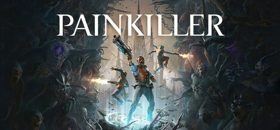 **PainKiller** | [PainKiller VR Mod](https://github.com/FluorescentHallucinogen/painkiller-vr-mod) | PCVR | 🚧 beta | [v0.1.9](https://github.com/FluorescentHallucinogen/painkiller-vr-mod/releases/latest) 2026-09-07 | [FluorescentHallucinogen](https://github.com/FluorescentHallucinogen) | [▶ Beardo Benjo](https://www.youtube.com/watch?v=IJg0zG5ViEM) [▶ Pavel419](https://www.youtube.com/watch?v=s469AllzjEc) |
|  **PainKiller: Battle Out of Hell** | [PainKiller VR Mod](https://github.com/FluorescentHallucinogen/painkiller-vr-mod) | PCVR | 🚧 beta | [v0.1.9](https://github.com/FluorescentHallucinogen/painkiller-vr-mod/releases/latest) 2026-09-07 | [FluorescentHallucinogen](https://github.com/FluorescentHallucinogen) | [▶ Beardo Benjo](https://www.youtube.com/watch?v=IJg0zG5ViEM) [▶ Pavel419](https://www.youtube.com/watch?v=s469AllzjEc) |
|  **Palworld** | [Palworld UEVR](https://www.patreon.com/D_Rey/posts/palworld-uevr-165894175) | PCVR | ✅ stable | [unversioned](https://www.patreon.com/D_Rey/posts/palworld-uevr-165894175) 2026-07-26 | D_Rey | [▶ Beardo Benjo](https://www.youtube.com/watch?v=i5OYgdTQSWI) [▶ ThisKory](https://www.youtube.com/watch?v=QV7U1btgztY) |
|  **PAYDAY 2** | [VR: Improvements Mod / VR+ (VR Plus) Continued](https://github.com/DennisGHUA/payday2-vr-improvements) | PCVR | 🚧 beta | [v0.8.8](https://github.com/DennisGHUA/payday2-vr-improvements/releases/latest) 2026-08-29 | [DennisGHUA](https://github.com/DennisGHUA) | [▶ Helixxvr](https://www.youtube.com/watch?v=fG8JXcdZ25M) [▶ Frontways Larry](https://www.youtube.com/watch?v=405RhWEMAK8) |
| 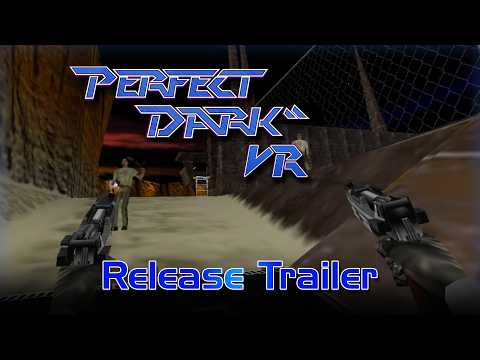 **Perfect Dark** | [Perfect Dark VR](https://github.com/Alex-LeTux/perfect_dark_VR) | PCVR + Standalone | 🚧 beta | [v2.0](https://github.com/Alex-LeTux/perfect_dark_VR/releases/latest) 2026-10-07 | [Alex Le Tux](https://github.com/Alex-LeTux) | [▶ Graslu00](https://www.youtube.com/watch?v=wkQiyeYn7QU) [▶ A Wolf in VR](https://www.youtube.com/watch?v=APpDgSHR-b0) |
|  **Pokemon Blue** | [1GenPokemonVR](https://github.com/heurazy/1genpokemonvr) | PCVR + Standalone | 🧪 alpha | [v0.2.46](https://github.com/heurazy/1GenPokemonVr/releases/latest) 2026-08-10 | [heurazy](https://github.com/heurazy) | — |
|  **Pokemon Red** | [1GenPokemonVR](https://github.com/heurazy/1genpokemonvr) | PCVR + Standalone | 🧪 alpha | [v0.2.46](https://github.com/heurazy/1GenPokemonVr/releases/latest) 2026-08-10 | [heurazy](https://github.com/heurazy) | — |
| 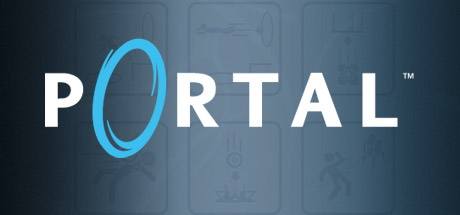 **Portal** | [SourceVR](https://github.com/tinsarfal/SourceVR) | Standalone | 🚧 beta | [0.1.28](https://github.com/tinsarfal/SourceVR/releases/latest) 2026-10-02 | [tinsarfal](https://github.com/tinsarfal) | [▶ LunchAndVR](https://www.youtube.com/watch?v=QzgDw8xEpeM) [▶ LunchAndVR](https://www.youtube.com/watch?v=kR_z39AJ-PQ) |
| 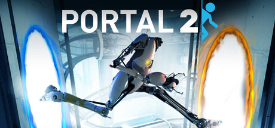 **Portal 2** | [SourceVR](https://github.com/tinsarfal/SourceVR) | Standalone | 🚧 beta | [0.1.28](https://github.com/tinsarfal/SourceVR/releases/latest) 2026-10-02 | [tinsarfal](https://github.com/tinsarfal) | [▶ LunchAndVR](https://www.youtube.com/watch?v=QzgDw8xEpeM) [▶ LunchAndVR](https://www.youtube.com/watch?v=kR_z39AJ-PQ) |
|  **Quake** | [QuakeQuest](https://github.com/Team-Beef-Studios/QuakeQuest) | Standalone | ✅ stable | [v1.6.0](https://github.com/Team-Beef-Studios/QuakeQuest/releases/latest) 2026-09-29 | [Team Beef](https://github.com/Team-Beef-Studios) | [▶ RaMarcus](https://www.youtube.com/watch?v=Lof2hd9DymQ) [▶ TechHoller](https://www.youtube.com/watch?v=ChXSfe7_eMI) |
| 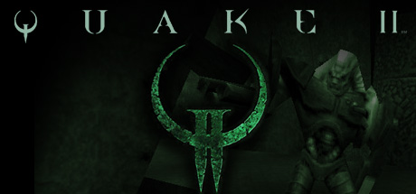 **Quake II** | [Quake2Quest](https://github.com/Team-Beef-Studios/Quake2Quest) | Standalone | ✅ stable | [v1.1.1](https://github.com/Team-Beef-Studios/Quake2Quest/releases/latest) 2026-09-29 | [Team Beef](https://github.com/Team-Beef-Studios) | [▶ DoomSly82](https://www.youtube.com/watch?v=PlvkJJvEKKE) [▶ Team Beef VR Game Ports](https://www.youtube.com/watch?v=xqDJtjeYo4k) |
| 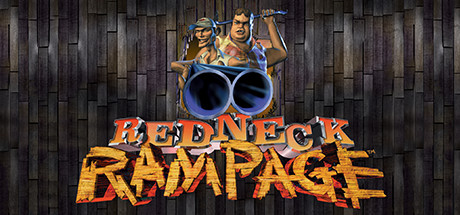 **Redneck Rampage** | [RazeXR](https://github.com/Team-Beef-Studios/RazeXR) | Standalone | ✅ stable | [v1.0.0](https://github.com/Team-Beef-Studios/RazeXR/releases/latest) 2023-09-30 | [Team Beef](https://github.com/Team-Beef-Studios) | [▶ VR Reviews](https://www.youtube.com/watch?v=dFiVi_xUjRc) [▶ VoodooDE VR](https://www.youtube.com/watch?v=h5vjhgyeNiE) |
|  **Resident Evil 2 (2019)** | [REFramework](https://github.com/praydog/REFramework) | PCVR | ✅ stable | [v1.5.9.1](https://github.com/praydog/REFramework/releases/latest) 2025-03-05 | [praydog](https://github.com/praydog) | [▶ MRTV - MIXED REALITY TV](https://www.youtube.com/watch?v=hySd4sHtcDE) [▶ Stereo3DProductions](https://www.youtube.com/watch?v=Ql5ggETipyM) |
|  **Resident Evil 3 (2020)** | [REFramework](https://github.com/praydog/REFramework) | PCVR | ✅ stable | [v1.5.9.1](https://github.com/praydog/REFramework/releases/latest) 2025-03-05 | [praydog](https://github.com/praydog) | [▶ MRTV - MIXED REALITY TV](https://www.youtube.com/watch?v=hySd4sHtcDE) [▶ Stereo3DProductions](https://www.youtube.com/watch?v=Ql5ggETipyM) |
|  **Resident Evil 4 (2023)** | [REFramework](https://github.com/praydog/REFramework) | PCVR | ✅ stable | [v1.5.9.1](https://github.com/praydog/REFramework/releases/latest) 2025-03-05 | [praydog](https://github.com/praydog) | [▶ MRTV - MIXED REALITY TV](https://www.youtube.com/watch?v=hySd4sHtcDE) [▶ Stereo3DProductions](https://www.youtube.com/watch?v=Ql5ggETipyM) |
| 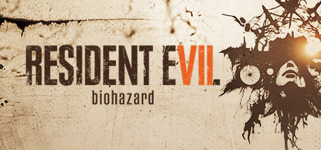 **Resident Evil 7** | [REFramework](https://github.com/praydog/REFramework) | PCVR | ✅ stable | [v1.5.9.1](https://github.com/praydog/REFramework/releases/latest) 2025-03-05 | [praydog](https://github.com/praydog) | [▶ MRTV - MIXED REALITY TV](https://www.youtube.com/watch?v=hySd4sHtcDE) [▶ Stereo3DProductions](https://www.youtube.com/watch?v=Ql5ggETipyM) |
|  **Resident Evil Village** | [REFramework](https://github.com/praydog/REFramework) | PCVR | ✅ stable | [v1.5.9.1](https://github.com/praydog/REFramework/releases/latest) 2025-03-05 | [praydog](https://github.com/praydog) | [▶ MRTV - MIXED REALITY TV](https://www.youtube.com/watch?v=hySd4sHtcDE) [▶ Stereo3DProductions](https://www.youtube.com/watch?v=Ql5ggETipyM) |
|  **Return to Castle Wolfenstein** | [RTCWQuest](https://github.com/Team-Beef-Studios/RTCWQuest) | Standalone | ✅ stable | [v1.4.1](https://github.com/Team-Beef-Studios/RTCWQuest/releases/latest) 2026-09-29 | [Team Beef](https://github.com/Team-Beef-Studios) | [▶ Pure Play TV](https://www.youtube.com/watch?v=kZJNHJdbBkU) [▶ GameCubits](https://www.youtube.com/watch?v=RIIGMVAeM-M) |
|  **Returnal** | [Returnal UEVR](https://github.com/letmein-vr/RETURNAL_UEVR) | PCVR | ✅ stable 4 known bugs | [1.2_IK](https://github.com/letmein-vr/RETURNAL_UEVR/releases/latest) 2026-08-01 | [letmein-vr](https://github.com/letmein-vr) | [▶ Gamertag VR](https://www.youtube.com/watch?v=hb3am-poQ9U) [▶ Waifu Enjoyer](https://www.youtube.com/watch?v=_1wjU3rwi78) |
| 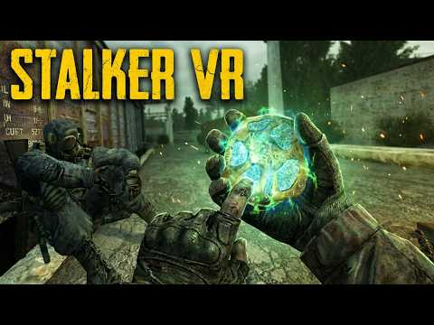 **S.T.A.L.K.E.R. Anomaly** | [S.T.A.L.K.E.R. Anomaly VR](https://ap-pro.ru/forums/topic/14575-anomaly-vr/) | PCVR | 🧪 alpha | [0.4.5](https://ap-pro.ru/forums/topic/14575-anomaly-vr/) 2026-05-09 | MarsyApp | [▶ Anomaly VR (Андрей MarsyApp)](https://www.youtube.com/watch?v=IIQGMCltW2M) [▶ Anomaly VR (Андрей MarsyApp)](https://www.youtube.com/watch?v=LhODMRyRGpk) |
| 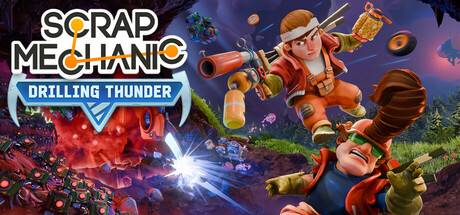 **Scrap Mechanic** | [Scrap Mechanic Native VR](https://github.com/21Suspect/Scrap-Mechanic-Native-VR) | PCVR | ✅ stable | [v1.4.8](https://github.com/21Suspect/Scrap-Mechanic-Native-VR/releases/latest) 2026-09-08 | [21Suspect](https://github.com/21Suspect) | [▶ U W I P](https://www.youtube.com/watch?v=FpFTF14iAb8) [▶ U W I P](https://www.youtube.com/watch?v=0RnKR7LIPsY) |
|  **Shadow Warrior** | [RazeXR](https://github.com/Team-Beef-Studios/RazeXR) | Standalone | ✅ stable | [v1.0.0](https://github.com/Team-Beef-Studios/RazeXR/releases/latest) 2023-09-30 | [Team Beef](https://github.com/Team-Beef-Studios) | [▶ VR Reviews](https://www.youtube.com/watch?v=dFiVi_xUjRc) [▶ VoodooDE VR](https://www.youtube.com/watch?v=h5vjhgyeNiE) |
| 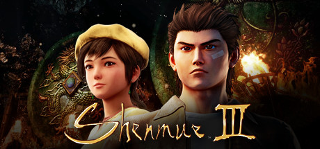 **Shenmue III** | [Shenmue III UEVR](https://codeberg.org/Tensai37/Shenmue_3_first_person_with_motion_controls_UEVR_mod/releases) | PCVR | ✅ stable 1 known bug | [1.0](https://codeberg.org/Tensai37/Shenmue_3_first_person_with_motion_controls_UEVR_mod/releases) 2026-05-30 | Tensai37 | [▶ VR 360°](https://www.youtube.com/watch?v=8chsqzPE9I0) [▶ Waifu Enjoyer](https://www.youtube.com/watch?v=WffgF8GJlyY) |
| 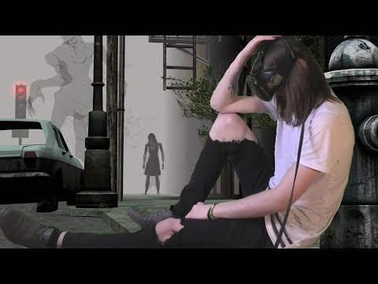 **Silent Hill (1999)** | [Silent Hill (1999) VR](https://www.patreon.com/u61517070/posts/silent-hill-1999-165598817) | PCVR | 🧪 alpha 1 known bug | [unversioned](https://www.patreon.com/u61517070/posts/silent-hill-1999-165598817) 2026-08-02 | VRified Games | [▶ Dredile](https://www.youtube.com/watch?v=PzReMsIgpOU) [▶ Silent Archives](https://www.youtube.com/watch?v=QXGVqJjTLoU) |
| 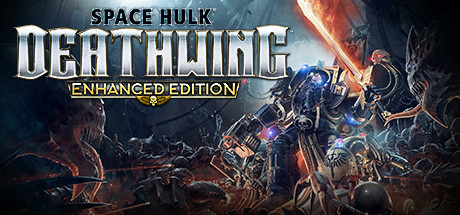 **Space Hulk: Deathwing Enhanced Edition** | [Space Hulk: Deathwing VR](https://github.com/helpimaghost/Space-Hulk-Deathwing-VR) | PCVR | ✅ stable 4 known bugs | [1.12](https://github.com/helpimaghost/Space-Hulk-Deathwing-VR/releases/latest) 2026-10-03 | [help im a ghost](https://github.com/helpimaghost), Pande4360 | [▶ help im a ghost](https://www.youtube.com/watch?v=FINK6QAYO50) |
| 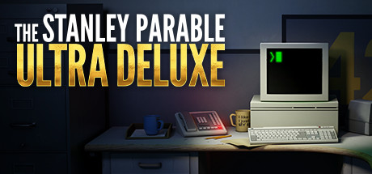 **The Stanley Parable: Ultra Deluxe** | [Stanley VR](https://github.com/Raicuparta/stanley-vr) | PCVR | 🚧 beta | [v0.4.0](https://github.com/Raicuparta/stanley-vr/releases/latest) 2023-04-10 | [Raicuparta](https://raicuparta.com) | [▶ Hoshi82](https://www.youtube.com/watch?v=vZ0oBfZNDAY) [▶ Headset-VR](https://www.youtube.com/watch?v=EFGV25MsUGA) |
|  **Star Trucker** | [Star Trucker VR](https://www.nexusmods.com/startrucker/mods/17) | PCVR | ✅ stable 1 known bug | [1.0](https://www.nexusmods.com/startrucker/mods/17) 2026-07-20 | Svveepa | — |
| 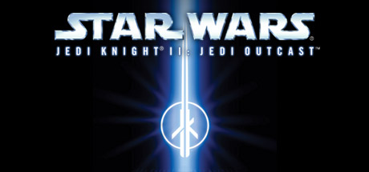 **Star Wars Jedi Knight II: Jedi Outcast** | [JKXR](https://github.com/Team-Beef-Studios/JKXR) | PCVR + Standalone | ✅ stable | [v1.2.0](https://github.com/Team-Beef-Studios/JKXR/releases/latest) 2026-09-29 | [Team Beef](https://github.com/Team-Beef-Studios) | [▶ fornix VR](https://www.youtube.com/watch?v=powgjtFAsyg) |
|  **Star Wars Jedi Knight: Jedi Academy** | [JKXR](https://github.com/Team-Beef-Studios/JKXR) | PCVR + Standalone | ✅ stable | [v1.2.0](https://github.com/Team-Beef-Studios/JKXR/releases/latest) 2026-09-29 | [Team Beef](https://github.com/Team-Beef-Studios) | [▶ fornix VR](https://www.youtube.com/watch?v=powgjtFAsyg) |
| 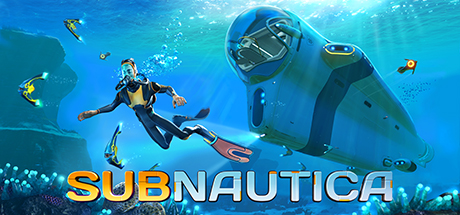 **Subnautica** | [SubmersedVR](https://github.com/Okabintaro/SubmersedVR) | PCVR | 🚧 beta | [0.2.0](https://github.com/Okabintaro/SubmersedVR/releases/latest) 2025-08-17 | [Okabintaro](https://github.com/Okabintaro) | [▶ Gamertag VR](https://www.youtube.com/watch?v=XAJC4XRomSA) [▶ Beardo Benjo](https://www.youtube.com/watch?v=m57MU3dw070) |
|  **Subnautica 2** | [Subnautica 2 UEVR](https://github.com/jbusfield/SN2_UEVR) | PCVR | ✅ stable | [v1.0.3](https://github.com/jbusfield/SN2_UEVR/releases/latest) 2026-07-08 | [jbusfield](https://github.com/jbusfield) | [▶ LunchAndVR](https://www.youtube.com/watch?v=7cHe25j0N-o) [▶ Beardo Benjo](https://www.youtube.com/watch?v=hbSxbvBot9Y) |
|  **Super Mario Galaxy** | [GalaxyQuest](https://github.com/bigmak94/GalaxyQuest) | Standalone | 🧪 alpha | [v0.1.8](https://github.com/bigmak94/GalaxyQuest/releases/latest) 2026-10-03 | [bigmak94](https://github.com/bigmak94) | [▶ Pixelacos VR](https://www.youtube.com/watch?v=d4gvdxW-iVY) [▶ GalaxyQuest](https://www.youtube.com/watch?v=Z35QW5irVcw) |
|  **Tom Clancy's Ghost Recon Wildlands** | [Ghost Recon Wildlands VR (GRW-XR)](https://github.com/Firejumper93/GhostReconWildlandsVR) | PCVR | 🧪 alpha 2 known bugs | [v0.11.1](https://github.com/Firejumper93/GhostReconWildlandsVR/releases/latest) 2026-09-13 | [Firejumper93](https://github.com/Firejumper93) | [▶ Geek2](https://www.youtube.com/watch?v=X1PRXN5gVX8) [▶ Geek2](https://www.youtube.com/watch?v=dMRfAHhmbbc) |
|  **Tomb Raider (1996)** | [BeefRaiderXR](https://github.com/Team-Beef-Studios/BeefRaiderXR) | Standalone | ✅ stable | [1.0.0](https://github.com/Team-Beef-Studios/BeefRaiderXR/releases/latest) 2024-09-29 | [Team Beef](https://github.com/Team-Beef-Studios) | [▶ UploadVR](https://www.youtube.com/watch?v=DxPmxvf9J7M) [▶ Pixelacos Gameplays](https://www.youtube.com/watch?v=NP2DatOD9IU) |
| 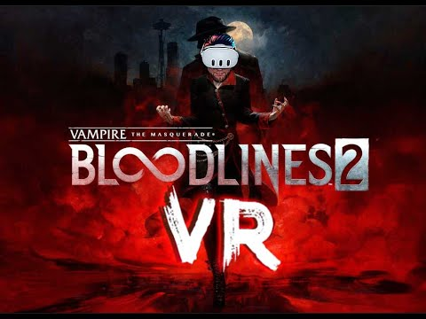 **Vampire: The Masquerade — Bloodlines 2** | [Vampire: The Masquerade — Bloodlines 2 UEVR](https://codeberg.org/Tensai37/Bloodlines2/releases) | PCVR | 🚧 beta 1 known bug | [1.1](https://codeberg.org/Tensai37/Bloodlines2/releases) 2026-06-11 | Tensai37 | [▶ Parzival_VR_EN](https://www.youtube.com/watch?v=7d7QMmmJOXQ) [▶ YouGotColdYogurt](https://www.youtube.com/watch?v=bn-bhvz3kxU) |
|  **The Witcher 3: Wild Hunt** | [The Witcher 3 VR](https://github.com/tig3rmast3r/witcher3-vr) | PCVR | 🧪 alpha 2 known bugs | [v0.9.8v2](https://github.com/tig3rmast3r/witcher3-vr/releases/latest) 2026-10-04 | [tig3rmast3r](https://github.com/tig3rmast3r) | [▶ NotAGameAddict](https://www.youtube.com/watch?v=ZghPdR9i1D4) [▶ ReaperzVR](https://www.youtube.com/watch?v=owIvBBtChic) |
|  **Wolfenstein 3-D** | [WolfSharp VR](https://benmclean.itch.io/wolfsharp) | PCVR | 🧪 alpha | [unversioned](https://benmclean.itch.io/wolfsharp) 2026-07-25 | Ben McLean | [▶ Ben Plays VR](https://www.youtube.com/watch?v=IXfuSlNU5ps) |

<!-- INDEX:END -->

## See also

Other catalogs worth knowing about. They are not affiliated with this one.

- [PCVR Central](https://pcvrcentral.com/): the largest PCVR mod catalog, with quality tiers and a Steam library checker.
- [RototRobot's VR Mods List](https://rototrobot.github.io/VRMods-List/): a long-running curated directory.
- [QuestPorts](https://questports.vercel.app/): standalone Quest ports, with install guides and in-browser install.
- [UEVR Profiles](https://uevr-profiles.com/): per-game UEVR profiles.
- [Flat2VR Discord](https://discord.gg/flat2vr): where most of these ports are announced and supported.

## License

Data and code: [CC0 1.0](LICENSE). Game images keep their owners' rights and are credited in each entry.
