# Flat2VR Index

Every flatscreen game you can play in VR, and the port that does it, on PCVR and standalone headsets.

**Submit or update a port:** see [CONTRIBUTING.md](CONTRIBUTING.md).

<!-- INDEX:START (generated by scripts/build.mjs, do not edit) -->

| Game | Port | Platform | Reviews |
|---|---|---|---|
| 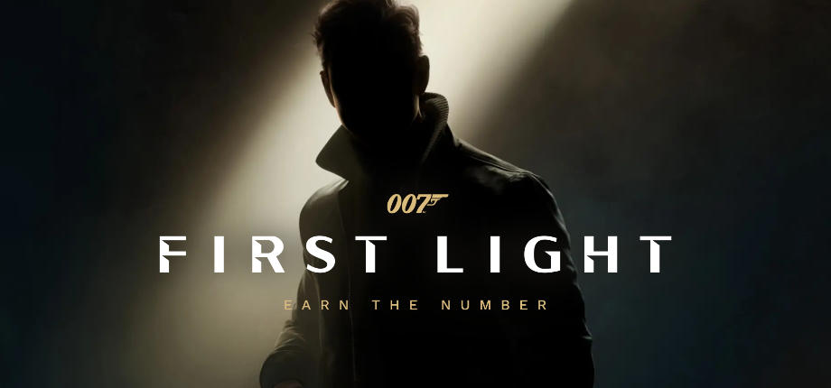 **007 First Light** | [007 First Light R.E.A.L. VR](https://www.patreon.com/realvr/posts/bond-159956522) by Luke Ross Latest: [unversioned](https://www.patreon.com/realvr/posts/bond-159956522) (2026-06-02) | PCVR 🚧 beta | [▶ NotAGameAddict](https://www.youtube.com/watch?v=bkY1nSzsIW8) [▶ YouGotColdYogurt](https://www.youtube.com/watch?v=qlWP_YPt76c) |
|  **ACE COMBAT 8** | [ACE COMBAT 8 UEVR Profile (HUD fix)](https://github.com/VTFLAB/ace-combat-8-uevr-profile) by [VTFLAB](https://github.com/VTFLAB) Latest: [v1.0.0](https://github.com/VTFLAB/ace-combat-8-uevr-profile/releases/latest) (2026-10-04) | PCVR ✅ stable 1 known bug | [▶ Paradise Decay](https://www.youtube.com/watch?v=weAhEMpT87k) [▶ NotAGameAddict](https://www.youtube.com/watch?v=spKprOsBkN8) |
| 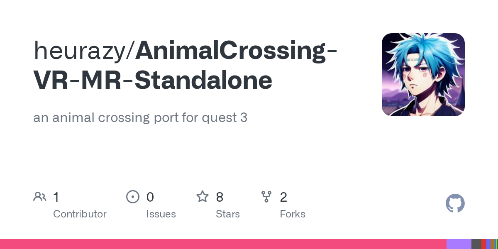 **Animal Crossing (GameCube)** | [Animal Crossing VR/MR Standalone](https://github.com/heurazy/AnimalCrossing-VR-MR-Standalone) by [heurazy](https://github.com/heurazy) Latest: [v1.0.2](https://github.com/heurazy/AnimalCrossing-VR-MR-Standalone/releases/latest) (2026-08-11) | Standalone 🚧 beta | — |
|  **Assassin's Creed IV: Black Flag** | [Assassin's Creed IV: Black Flag Resynced VR](https://www.patreon.com/NoMoreFlat/posts/assassins-creed-164150917) by Mutar / NoMoreFlat Latest: [unversioned](https://www.patreon.com/NoMoreFlat/posts/assassins-creed-164150917) (2026-07-18) | PCVR 🚧 beta 3 known bugs | [▶ BrothersGanes](https://www.youtube.com/watch?v=rlLao3Q6tvg) |
| 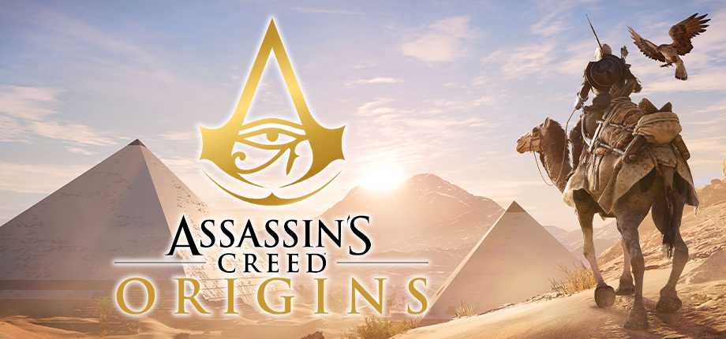 **Assassin's Creed Origins** | [Assassin's Creed Origins VR](https://www.patreon.com/NoMoreFlat/posts/assasins-creed-164608087) by Mutar, NoMoreFlat Latest: [unversioned](https://www.patreon.com/NoMoreFlat/posts/assasins-creed-164608087) (2026-07-23) | PCVR 🚧 beta 1 known bug | [▶ THEGAMEVEDA](https://www.youtube.com/watch?v=OFwRzPdAaHM) [▶ Techno Tamizha](https://www.youtube.com/watch?v=M1OoTOAHWOA) |
|  **Banjo-Kazooie** | [Banjo-Kazooie VR](https://github.com/RaYRoD-TV/MVRH) by RaYRoD-TV Latest: [Patch 3](https://github.com/RaYRoD-TV/MVRH/releases) (2026-10-09) | PCVR 🧪 alpha | [▶ legaiaflame](https://www.youtube.com/watch?v=k25Mopn0u5k) [▶ Drekwiz](https://www.youtube.com/watch?v=iJwDR0ahuBc) |
|  **Bendy and the Ink Machine** | [BendyVR](https://github.com/Team-Beef-Studios/BendyVR) by [Team Beef](https://github.com/Team-Beef-Studios) Latest: [v.1.2.2](https://github.com/Team-Beef-Studios/BendyVR/releases/latest) (2024-07-13) | PCVR ✅ stable | [▶ 99TH VR](https://www.youtube.com/watch?v=EsnSDiytst8) [▶ Vano](https://www.youtube.com/watch?v=FjC5Rnk_cOs) |
| 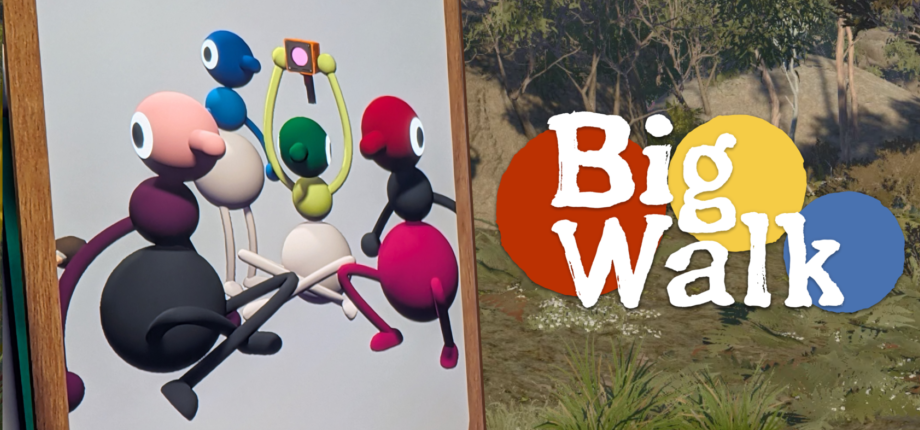 **Big Walk** | [Big Walk VR](https://github.com/CircuitLord/CircuitLordVRModInstaller) by [CircuitLord](https://github.com/CircuitLord) Latest: [v1.2.9](https://github.com/CircuitLord/CircuitLordVRModInstaller/releases/latest/download/CircuitLordVRModInstaller.exe) (2026-10-06) | PCVR ✅ stable | [▶ BamBaeYoh](https://www.youtube.com/watch?v=SXSZO6CctfM) [▶ Sk0l](https://www.youtube.com/watch?v=zMMNyRHrgBg) |
| 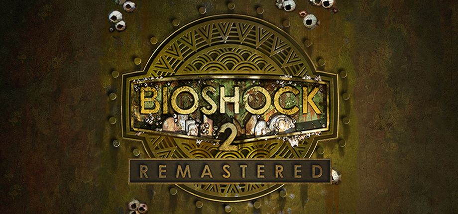 **BioShock 2 Remastered** | [BioShock VR](https://github.com/VR-Stereo-Hub/bioshock-trilogy-vr) by [VR-Stereo-Hub](https://github.com/VR-Stereo-Hub) Latest: [v0.8.3](https://github.com/VR-Stereo-Hub/bioshock-trilogy-vr/releases/latest) (2026-09-10) | PCVR 🧪 alpha 2 known bugs | [▶ Beardo Benjo](https://www.youtube.com/watch?v=4vC_-AKmVeA) [▶ Beardo Benjo](https://www.youtube.com/watch?v=s5XfXX5xpsA) |
| 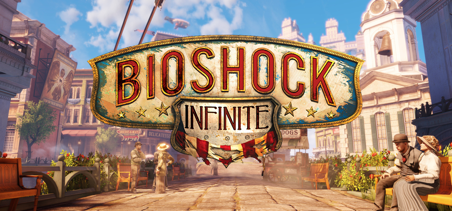 **BioShock Infinite** | [BioShock VR](https://github.com/VR-Stereo-Hub/bioshock-trilogy-vr) by [VR-Stereo-Hub](https://github.com/VR-Stereo-Hub) Latest: [v0.8.3](https://github.com/VR-Stereo-Hub/bioshock-trilogy-vr/releases/latest) (2026-09-10) | PCVR 🧪 alpha 2 known bugs | [▶ Beardo Benjo](https://www.youtube.com/watch?v=4vC_-AKmVeA) [▶ Beardo Benjo](https://www.youtube.com/watch?v=s5XfXX5xpsA) |
|  **BioShock Remastered** | [BioShock Remastered VR](https://github.com/BioVRDev/Bioshock-Remastered-VR) by [BioVRDev](https://github.com/BioVRDev), Pizzzaparker Latest: [v1.0.3a](https://github.com/BioVRDev/Bioshock-Remastered-VR/releases/latest) (2026-08-14) | PCVR ✅ stable | [▶ Mac In VR](https://www.youtube.com/watch?v=QKVw10Tt_2c) [▶ VoodooDE VR - english version -](https://www.youtube.com/watch?v=QH5imGj8PjE) |
| 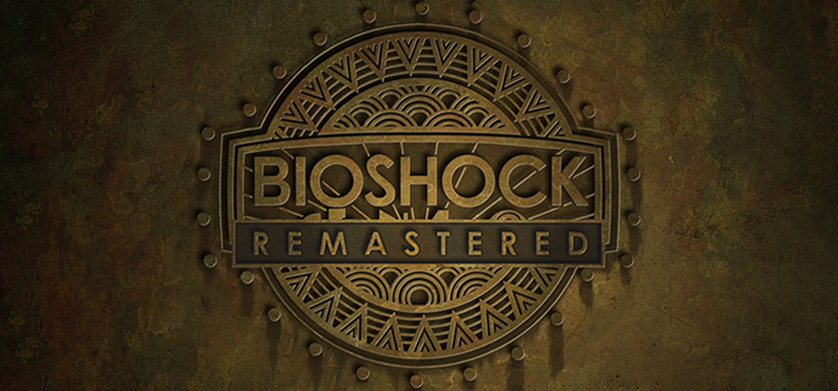 **BioShock Remastered** | [BioShock VR](https://github.com/VR-Stereo-Hub/bioshock-trilogy-vr) by [VR-Stereo-Hub](https://github.com/VR-Stereo-Hub) Latest: [v0.8.3](https://github.com/VR-Stereo-Hub/bioshock-trilogy-vr/releases/latest) (2026-09-10) | PCVR 🧪 alpha 2 known bugs | [▶ Beardo Benjo](https://www.youtube.com/watch?v=4vC_-AKmVeA) [▶ Beardo Benjo](https://www.youtube.com/watch?v=s5XfXX5xpsA) |
|  **Blood** | [RazeXR](https://github.com/Team-Beef-Studios/RazeXR) by [Team Beef](https://github.com/Team-Beef-Studios) Latest: [v1.0.0](https://github.com/Team-Beef-Studios/RazeXR/releases/latest) (2023-09-30) | Standalone ✅ stable | [▶ VR Reviews](https://www.youtube.com/watch?v=dFiVi_xUjRc) [▶ VoodooDE VR](https://www.youtube.com/watch?v=h5vjhgyeNiE) |
|  **Call of Duty 4: Modern Warfare** | [KisakCOD VR WinlatorXR](https://github.com/SgtBilko76/CallOfDuty4_VR_WinlatorXR) by [SgtBilko76](https://github.com/SgtBilko76), jplakon, SwagSoftware Latest: [v0.1.0-beta.1](https://github.com/SgtBilko76/CallOfDuty4_VR_WinlatorXR/releases/latest) (2026-09-20) | Standalone 🚧 beta 4 known bugs | [▶ NotAGameAddict](https://www.youtube.com/watch?v=NlR_JheVXCk) |
|  **Call of Duty 4: Modern Warfare (2007)** | [KisakCOD VR](https://github.com/jplakon/CallOfDuty4_VR) by JplayUltimate, [jplakon](https://github.com/jplakon) Latest: [v0.10.0-beta.19](https://github.com/jplakon/CallOfDuty4_VR/releases/latest) (2026-09-23) | PCVR 🚧 beta 3 known bugs | [▶ NotAGameAddict](https://www.youtube.com/watch?v=NlR_JheVXCk) [▶ StrainZex](https://www.youtube.com/watch?v=IfMoMmu5rhA) |
| 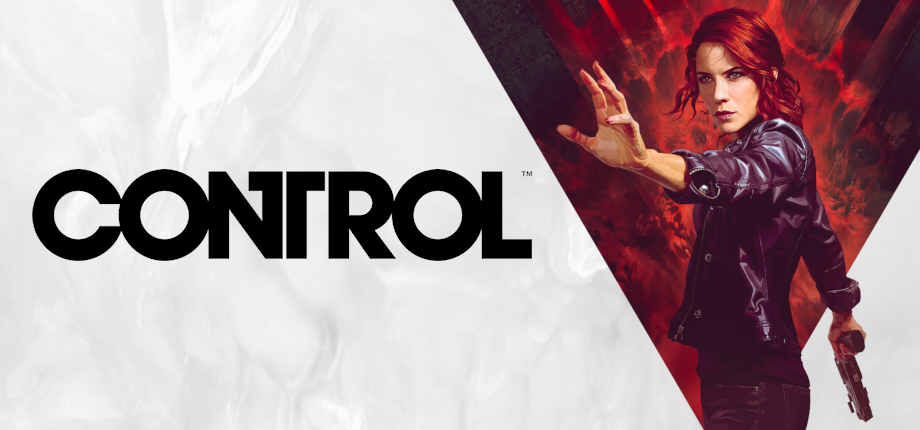 **Control** | [Control VR](https://www.patreon.com/NoMoreFlat/posts/control-vr-dev-161743534) by Mutar (NoMoreFlat) Latest: [unversioned](https://www.patreon.com/NoMoreFlat/posts/control-vr-dev-161743534) (2026-07-02) | PCVR 🚧 beta 2 known bugs | [▶ Kory & Brooke](https://www.youtube.com/watch?v=6DJ01fHF8Sc) [▶ PowerOnVR](https://www.youtube.com/watch?v=0rXO54K3iYM) |
| 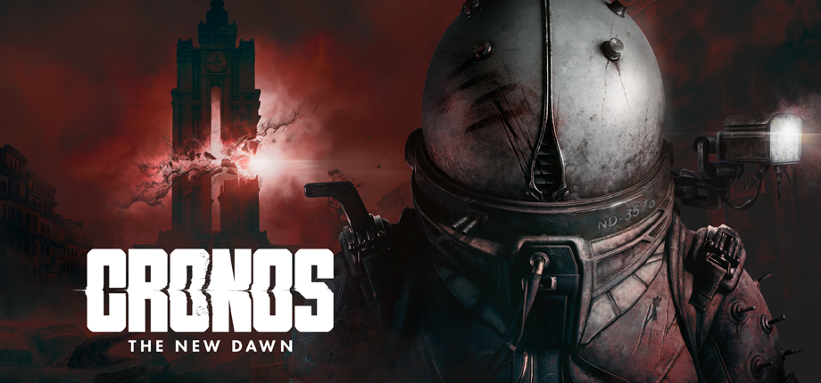 **Cronos: The New Dawn** | [Cronos: The New Dawn UEVR](https://github.com/letmein-vr/CRONOS_UEVR) by [letmein-vr](https://github.com/letmein-vr) Latest: [1.2](https://github.com/letmein-vr/CRONOS_UEVR/releases/latest) (2026-08-01) | PCVR ✅ stable 2 known bugs | [▶ Paradise Decay](https://www.youtube.com/watch?v=0bOrTZ69bbQ) [▶ NotAGameAddict](https://www.youtube.com/watch?v=XMWrEvKC7QU) |
| 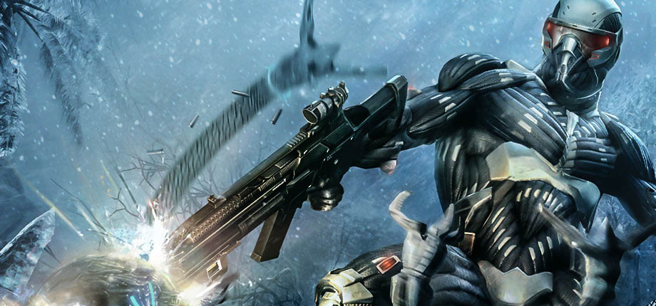 **Crysis** | [Crysis VR WinlatorXR](https://github.com/SgtBilko76/Crysis-VR-WinlatorXR) by [SgtBilko76](https://github.com/SgtBilko76), fholger Latest: [Beta-0.3](https://github.com/SgtBilko76/Crysis-VR-WinlatorXR/releases/latest) (2026-09-16) | Standalone 🚧 beta | [▶ Parzival_VR_EN](https://www.youtube.com/watch?v=cwGWHTBZ5SU) [▶ Louie's VR Corner](https://www.youtube.com/watch?v=X362mNKhA7U) |
| 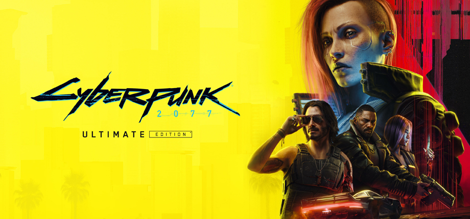 **Cyberpunk 2077** | [CyberpunkVR Port](https://github.com/dariulone/cyberpunk-vr-port) by [dariulone](https://github.com/dariulone) Latest: [0.1.7](https://github.com/dariulone/cyberpunk-vr-port/releases/latest) (2026-09-29) | PCVR 🚧 beta | [▶ Beardo Benjo](https://www.youtube.com/watch?v=bqWALEvZ1to) [▶ Beardo Benjo](https://www.youtube.com/watch?v=XkzaBRPJoQE) |
| 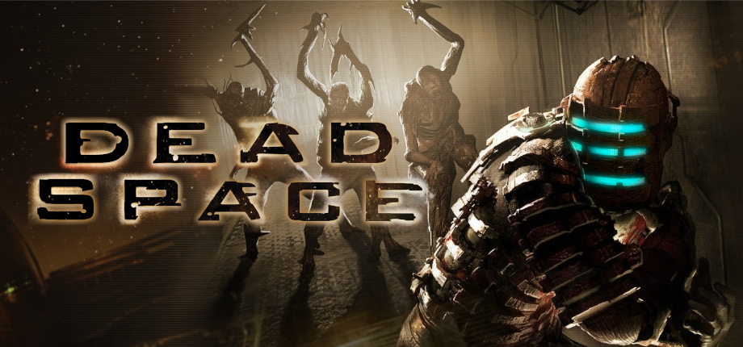 **Dead Space (2023)** | [Dead Space (2023) R.E.A.L. VR](https://www.patreon.com/realvr/posts/ds2023-165285354) by Luke Ross Latest: [2607.31.2](https://www.patreon.com/realvr/posts/ds2023-165285354) (2026-07-31) | PCVR 🚧 beta | [▶ Beardo Benjo](https://www.youtube.com/watch?v=i8kqEA6QuM4) [▶ Beardo Benjo](https://www.youtube.com/watch?v=lvCuaE87zS0) |
| 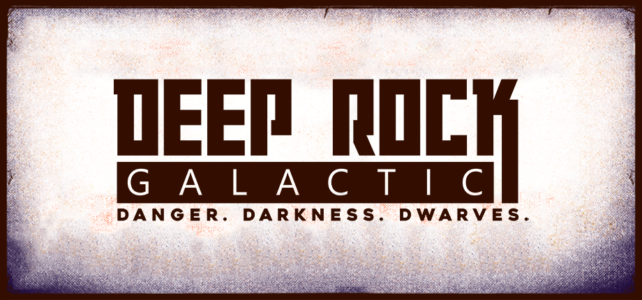 **Deep Rock Galactic** | [VRG](https://mod.io/g/drg/m/vrg) by Unknown Latest: [unversioned](https://mod.io/g/drg/m/vrg) (2026-10-09) | PCVR 🚧 beta | [▶ Beardo Benjo](https://www.youtube.com/watch?v=jrcGVagjNpc) [▶ MedvediVodki](https://www.youtube.com/watch?v=HcI-ybJrUAs) |
| 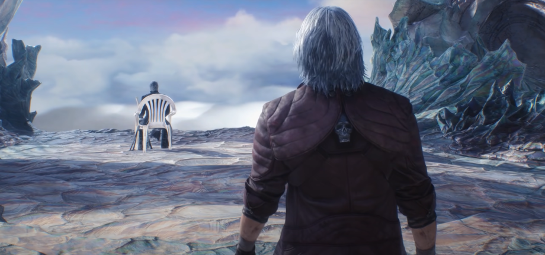 **Devil May Cry 5** | [REFramework](https://github.com/praydog/REFramework) by [praydog](https://github.com/praydog) Latest: [v1.5.9.1](https://github.com/praydog/REFramework/releases/latest) (2025-03-05) | PCVR ✅ stable | [▶ MRTV - MIXED REALITY TV](https://www.youtube.com/watch?v=hySd4sHtcDE) [▶ Stereo3DProductions](https://www.youtube.com/watch?v=Ql5ggETipyM) |
| 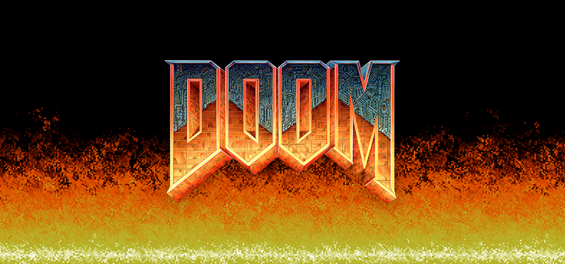 **Doom** | [QuestZDoom](https://github.com/Team-Beef-Studios/QuestZDoom) by [Team Beef](https://github.com/Team-Beef-Studios) Latest: [1.6.2](https://github.com/Team-Beef-Studios/QuestZDoom/releases/latest) (2026-09-30) | Standalone ✅ stable | [▶ Beardo Benjo](https://www.youtube.com/watch?v=YelM8MdzzpI) [▶ VR Reviews](https://www.youtube.com/watch?v=LwT1aKRGcOA) |
| 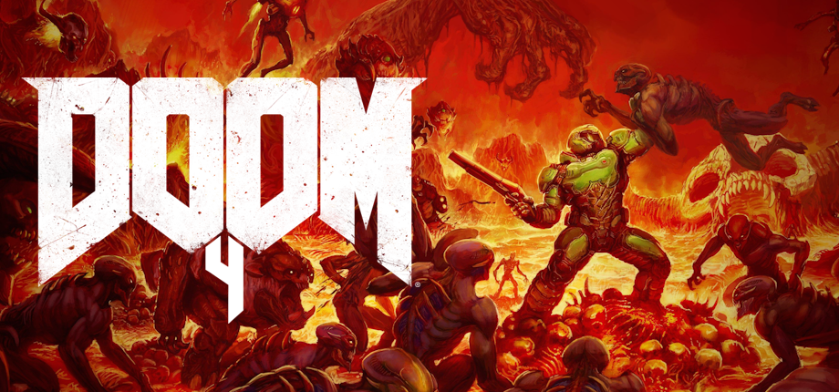 **DOOM (2016)** | [DOOM (2016) R.E.A.L. VR](https://www.patreon.com/realvr/posts/doom-162879153) by Luke Ross Latest: [2607.31.1](https://www.patreon.com/realvr/posts/doom-162879153) (2026-07-04) | PCVR 🚧 beta | [▶ Beardo Benjo](https://www.youtube.com/watch?v=rf1aWozpwK0) [▶ Gamertag VR](https://www.youtube.com/watch?v=5BCafGSVhN0) |
| 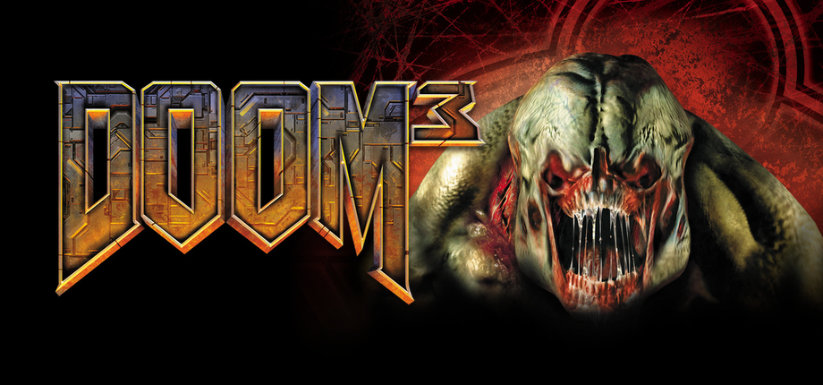 **Doom 3** | [Doom3Quest](https://github.com/Team-Beef-Studios/Doom3Quest) by [Team Beef](https://github.com/Team-Beef-Studios) Latest: [v1.4.8](https://github.com/Team-Beef-Studios/Doom3Quest/releases/latest) (2026-09-30) | Standalone ✅ stable | [▶ Team Beef VR Game Ports](https://www.youtube.com/watch?v=y2y9C0E2kPk) [▶ Gamertag VR](https://www.youtube.com/watch?v=U4aRzfja8xg) |
| 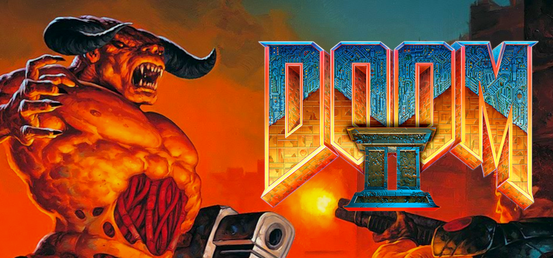 **Doom II** | [QuestZDoom](https://github.com/Team-Beef-Studios/QuestZDoom) by [Team Beef](https://github.com/Team-Beef-Studios) Latest: [1.6.2](https://github.com/Team-Beef-Studios/QuestZDoom/releases/latest) (2026-09-30) | Standalone ✅ stable | [▶ Beardo Benjo](https://www.youtube.com/watch?v=YelM8MdzzpI) [▶ VR Reviews](https://www.youtube.com/watch?v=LwT1aKRGcOA) |
| 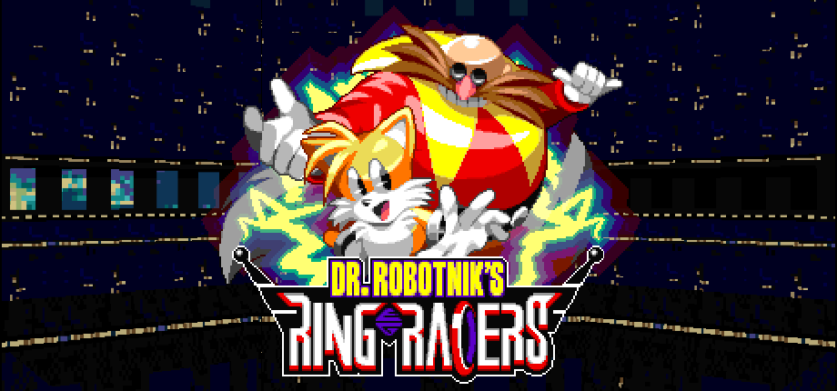 **Dr. Robotnik's Ring Racers** | [Dr. Robotnik's Ring Racers VR](https://github.com/RaYRoD-TV/MVRH) by RaYRoD-TV Latest: [Patch 3](https://github.com/RaYRoD-TV/MVRH/releases) (2026-10-09) | PCVR 🚧 beta | [▶ legaiaflame](https://www.youtube.com/watch?v=zZoC6sKsX9U) |
| 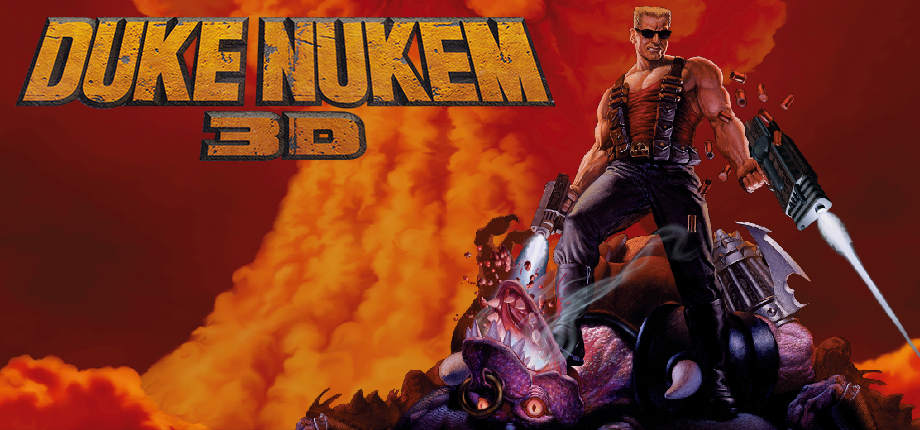 **Duke Nukem 3D** | [RazeXR](https://github.com/Team-Beef-Studios/RazeXR) by [Team Beef](https://github.com/Team-Beef-Studios) Latest: [v1.0.0](https://github.com/Team-Beef-Studios/RazeXR/releases/latest) (2023-09-30) | Standalone ✅ stable | [▶ VR Reviews](https://www.youtube.com/watch?v=dFiVi_xUjRc) [▶ VoodooDE VR](https://www.youtube.com/watch?v=h5vjhgyeNiE) |
| 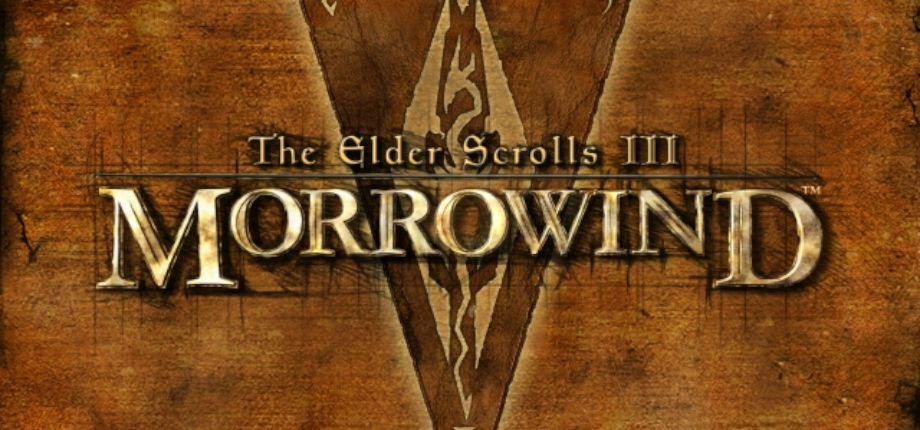 **The Elder Scrolls III: Morrowind** | [OpenMW VR](https://gitlab.com/madsbuvi/openmw) by Mads Buvik Sandvei Latest: [unversioned](https://gitlab.com/madsbuvi/openmw) (2026-10-09) | PCVR ✅ stable | [▶ Paradise Decay](https://www.youtube.com/watch?v=7xgJZve3ZpE) [▶ Immersed Robot](https://www.youtube.com/watch?v=7kqEdA5f4Jg) |
| 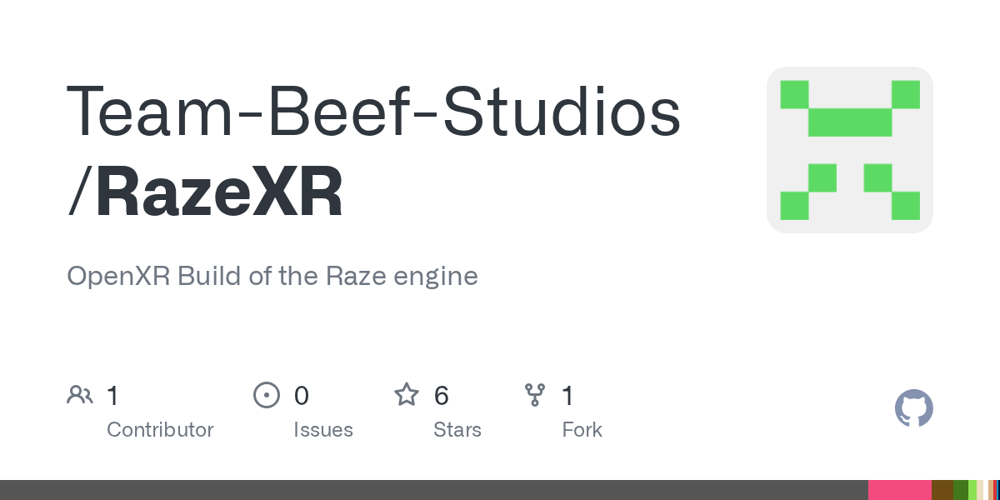 **Exhumed** | [RazeXR](https://github.com/Team-Beef-Studios/RazeXR) by [Team Beef](https://github.com/Team-Beef-Studios) Latest: [v1.0.0](https://github.com/Team-Beef-Studios/RazeXR/releases/latest) (2023-09-30) | Standalone ✅ stable | [▶ VR Reviews](https://www.youtube.com/watch?v=dFiVi_xUjRc) [▶ VoodooDE VR](https://www.youtube.com/watch?v=h5vjhgyeNiE) |
| 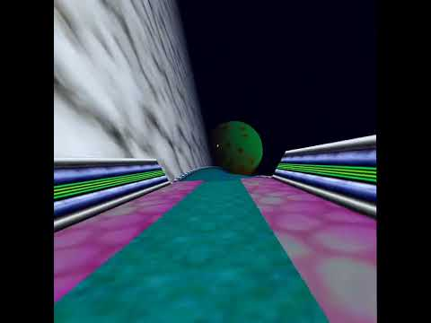 **F-Zero X** | [F-Zero X VR Standalone](https://github.com/heurazy/FzeroVR-Standalone) by [heurazy](https://github.com/heurazy) Latest: [v1.0.1](https://github.com/heurazy/FzeroVR-Standalone/releases/latest) (2026-08-14) | Standalone 🚧 beta | [▶ Trev](https://www.youtube.com/watch?v=CheaOy69uEo) |
| 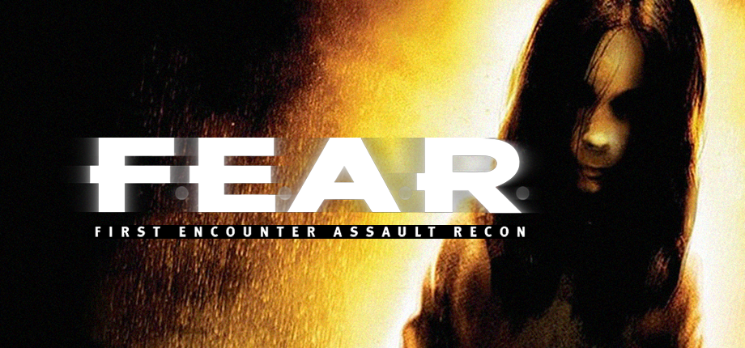 **F.E.A.R.** | [F.E.A.R. VR](https://github.com/DR-89/fear-vr) by [DR-89](https://github.com/DR-89) Latest: [v1.0.0-beta.8](https://github.com/DR-89/fear-vr/releases/latest) (2026-08-04) | PCVR 🚧 beta | [▶ TheFreeMike](https://www.youtube.com/watch?v=mIsvNvWRc-w) [▶ TheFreeMike](https://www.youtube.com/watch?v=LHwgHBhKbjE) |
| 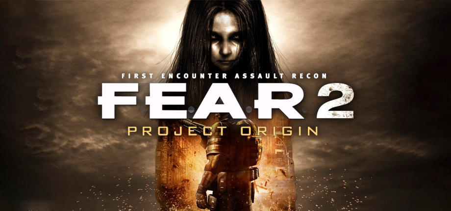 **F.E.A.R. 2: Project Origin** | [FEAR2VR](https://github.com/praydog/FEAR2VR) by [Praydog](https://github.com/praydog) Latest: [unversioned](https://github.com/praydog/FEAR2VR) (2026-08-09) | PCVR 🧪 alpha | — |
|  **Far Cry (2004)** | [Far Cry VR](https://farcryvr.de/) by Holger Frydrych Latest: [unversioned](https://farcryvr.de/) (2026-10-09) | PCVR ✅ stable | [▶ MAME-FAN](https://www.youtube.com/watch?v=8sD5DVkP9vI) [▶ Beardo Benjo](https://www.youtube.com/watch?v=ndyG_lw7ZeU) |
| 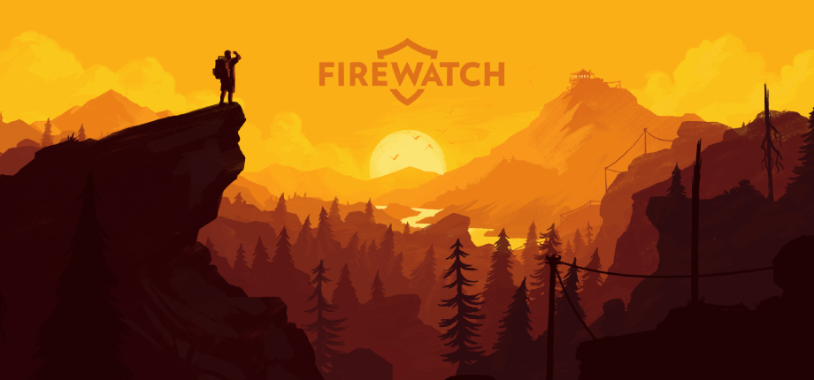 **Firewatch** | [Two Forks VR](https://github.com/Raicuparta/two-forks-vr) by [Raicuparta](https://raicuparta.com) Latest: [v2.1.0](https://github.com/Raicuparta/two-forks-vr/releases/latest) (2022-08-19) | PCVR ✅ stable | [▶ VoodooDE VR](https://www.youtube.com/watch?v=aIAuiCtT9Lw) [▶ VoodooDE VR - english version -](https://www.youtube.com/watch?v=lrqEuM8T8xc) |
| 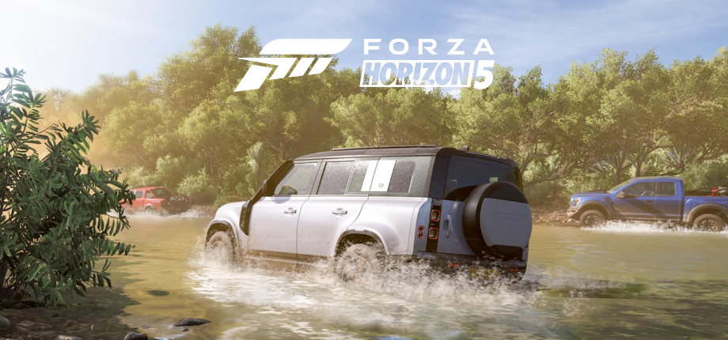 **Forza Horizon 5** | [Forza VRMod](https://github.com/oofz/vrmod-releases) by lufz, [oofz](https://github.com/oofz) Latest: [v1.4.2](https://github.com/oofz/vrmod-releases/releases/latest) (2026-09-08) | PCVR 🚧 beta | [▶ SimplyPops](https://www.youtube.com/watch?v=D3vgxYuoxr8) [▶ coolkidfrmbx](https://www.youtube.com/watch?v=--EgpTztmxw) |
| 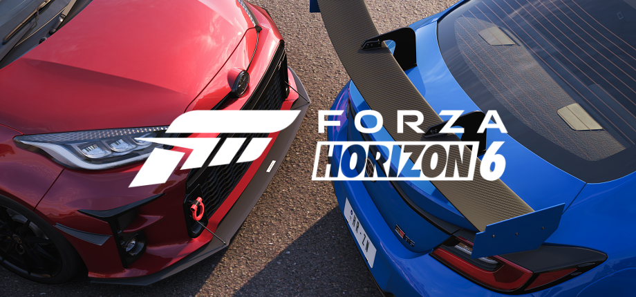 **Forza Horizon 6** | [Forza VRMod](https://github.com/oofz/vrmod-releases) by lufz, [oofz](https://github.com/oofz) Latest: [v1.4.2](https://github.com/oofz/vrmod-releases/releases/latest) (2026-09-08) | PCVR 🚧 beta | [▶ SimplyPops](https://www.youtube.com/watch?v=D3vgxYuoxr8) [▶ coolkidfrmbx](https://www.youtube.com/watch?v=--EgpTztmxw) |
| 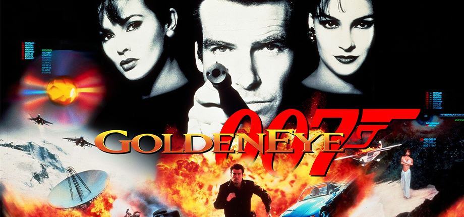 **GoldenEye 007** | [GoldenEye VR](https://github.com/MrSco/goldeneye-vr) by [MrSco](https://github.com/MrSco) Latest: [v0.4.14](https://github.com/MrSco/goldeneye-vr/releases/latest) (2026-10-08) | Standalone 🚧 beta | [▶ LunchAndVR](https://www.youtube.com/watch?v=4tPkNMYzDjY) [▶ NotAGameAddict](https://www.youtube.com/watch?v=DYKvCZazyJA) |
| 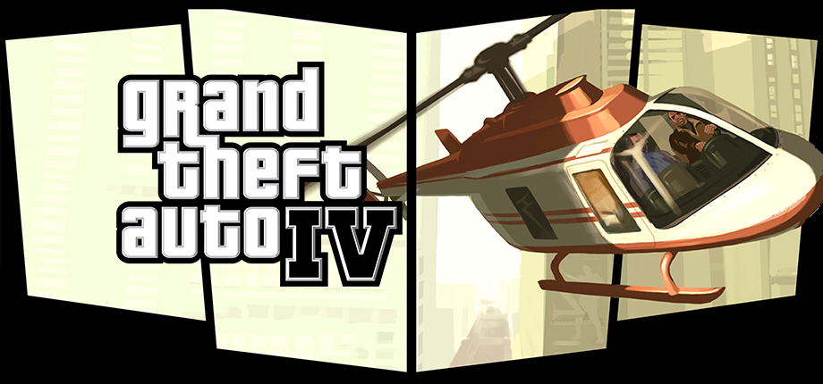 **Grand Theft Auto IV** | [Grand Theft Auto IV VR](https://github.com/Hochgeschwindigkeitsrennfahrer/Grand-Theft-Auto-IV-VR-Mod) by [Hochgeschwindigkeitsrennfahrer](https://github.com/Hochgeschwindigkeitsrennfahrer) Latest: [GTA4VR](https://github.com/Hochgeschwindigkeitsrennfahrer/Grand-Theft-Auto-IV-VR-Mod/releases/latest) (2026-08-04) | PCVR 🧪 alpha 2 known bugs | [▶ NotAGameAddict](https://www.youtube.com/watch?v=qJbdckHlBmM) [▶ MrIch325](https://www.youtube.com/watch?v=JkVdSyDpg78) |
|  **Grand Theft Auto: San Andreas - The Definitive Edition** | [SAN ANDREAS VR DEFINITIVE EDITION](https://github.com/Gangbusters1337/SAN-ANDREAS-VR-DEFINITIVE-EDITION) by [Gangbusters1337](https://github.com/Gangbusters1337) Latest: [v0.3.7](https://github.com/Gangbusters1337/SAN-ANDREAS-VR-DEFINITIVE-EDITION/releases/latest) (2026-09-09) | PCVR 🚧 beta | — |
|  **Grand Theft Auto: Vice City** | [Vice City VR](https://github.com/dubrovskiy-yevhen-stakelogic/vice-city-vr) by dubrovskiy-yevhen-stakelogic Latest: [v0.5.5.1](https://github.com/dubrovskiy-yevhen-stakelogic/vice-city-vr/releases/latest) (2026-09-14) | PCVR + Standalone 🧪 alpha | [▶ Vlad Yaps](https://www.youtube.com/watch?v=2e0IqwScrVk) [▶ Beyond Meta](https://www.youtube.com/watch?v=eEVMxo9YLLI) |
|  **Gunfire Reborn** | [GunfireRebornVRMod](https://github.com/xPrinny/GunfireRebornVRMod) by [xPrinny](https://github.com/xPrinny), [PureDark](https://github.com/PureDark) Latest: [1.0.6.1](https://github.com/xPrinny/GunfireRebornVRMod/releases/latest) (2024-03-19) | PCVR ✅ stable | [▶ Eurogamer](https://www.youtube.com/watch?v=WL9V5aDS7_c) [▶ Laserfights](https://www.youtube.com/watch?v=TQTKvaMpzOE) |
| 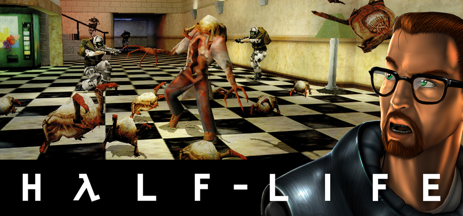 **Half-Life** | [Lambda1VR](https://github.com/Team-Beef-Studios/Lambda1VR) by [Team Beef](https://github.com/Team-Beef-Studios) Latest: [v1.7.4](https://github.com/Team-Beef-Studios/Lambda1VR/releases/latest) (2026-09-29) | Standalone ✅ stable | [▶ BMFVR](https://www.youtube.com/watch?v=A11e-h6qgDM) [▶ Matteo311](https://www.youtube.com/watch?v=5eRyhJwN1c0) |
|  **Half-Life 2** | [Half-Life 2: VR Mod](https://store.steampowered.com/app/658920/) by Source VR Mod Team Latest: [Steam (auto-updates)](https://store.steampowered.com/app/658920/) (2023-04-06) | PCVR ✅ stable | [▶ Bonezz](https://www.youtube.com/watch?v=z8LRyoxo7kQ) [▶ 99TH VR](https://www.youtube.com/watch?v=0X7h9nVNHX8) |
| 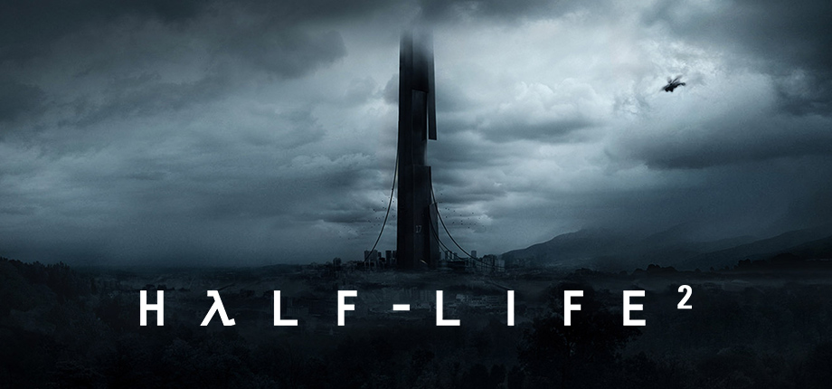 **Half-Life 2** | [SourceVR](https://github.com/tinsarfal/SourceVR) by [tinsarfal](https://github.com/tinsarfal) Latest: [0.1.28](https://github.com/tinsarfal/SourceVR/releases/latest) (2026-10-02) | Standalone 🚧 beta | [▶ LunchAndVR](https://www.youtube.com/watch?v=QzgDw8xEpeM) [▶ LunchAndVR](https://www.youtube.com/watch?v=kR_z39AJ-PQ) |
| 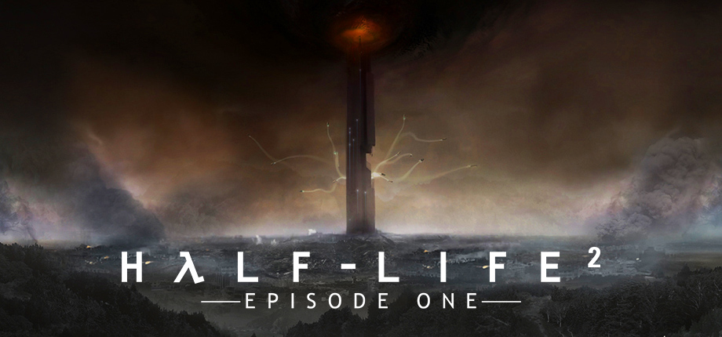 **Half-Life 2: Episode One** | [Half-Life 2: VR Mod](https://store.steampowered.com/app/658920/) by Source VR Mod Team Latest: [Steam (auto-updates)](https://store.steampowered.com/app/658920/) (2023-04-06) | PCVR ✅ stable | [▶ Bonezz](https://www.youtube.com/watch?v=z8LRyoxo7kQ) [▶ 99TH VR](https://www.youtube.com/watch?v=0X7h9nVNHX8) |
|  **Half-Life 2: Episode One** | [SourceVR](https://github.com/tinsarfal/SourceVR) by [tinsarfal](https://github.com/tinsarfal) Latest: [0.1.28](https://github.com/tinsarfal/SourceVR/releases/latest) (2026-10-02) | Standalone 🚧 beta | [▶ LunchAndVR](https://www.youtube.com/watch?v=QzgDw8xEpeM) [▶ LunchAndVR](https://www.youtube.com/watch?v=kR_z39AJ-PQ) |
|  **Half-Life 2: Episode Two** | [Half-Life 2: VR Mod](https://store.steampowered.com/app/658920/) by Source VR Mod Team Latest: [Steam (auto-updates)](https://store.steampowered.com/app/658920/) (2023-04-06) | PCVR ✅ stable | [▶ Bonezz](https://www.youtube.com/watch?v=z8LRyoxo7kQ) [▶ 99TH VR](https://www.youtube.com/watch?v=0X7h9nVNHX8) |
|  **Half-Life 2: Episode Two** | [SourceVR](https://github.com/tinsarfal/SourceVR) by [tinsarfal](https://github.com/tinsarfal) Latest: [0.1.28](https://github.com/tinsarfal/SourceVR/releases/latest) (2026-10-02) | Standalone 🚧 beta | [▶ LunchAndVR](https://www.youtube.com/watch?v=QzgDw8xEpeM) [▶ LunchAndVR](https://www.youtube.com/watch?v=kR_z39AJ-PQ) |
| 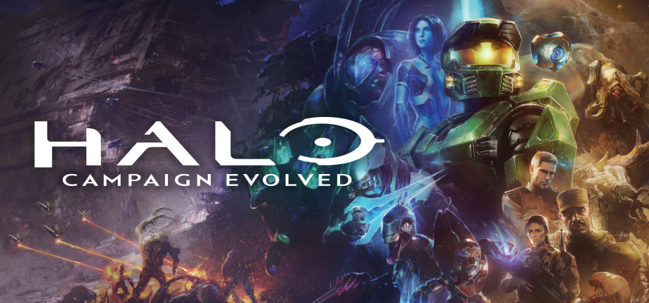 **Halo: Campaign Evolved** | [Halo: Campaign Evolved UEVR](https://github.com/MOTYSHIZ/HaloCampaignEvolved_UEVR) by [MOTYSHIZ](https://github.com/MOTYSHIZ) Latest: [v0.7.0](https://github.com/MOTYSHIZ/HaloCampaignEvolved_UEVR/releases/latest) (2026-10-06) | PCVR 🧪 alpha | [▶ LunchAndVR](https://www.youtube.com/watch?v=rVQWN7DvcMA) [▶ ThisKory](https://www.youtube.com/watch?v=_XOhW_B2e6k) |
| 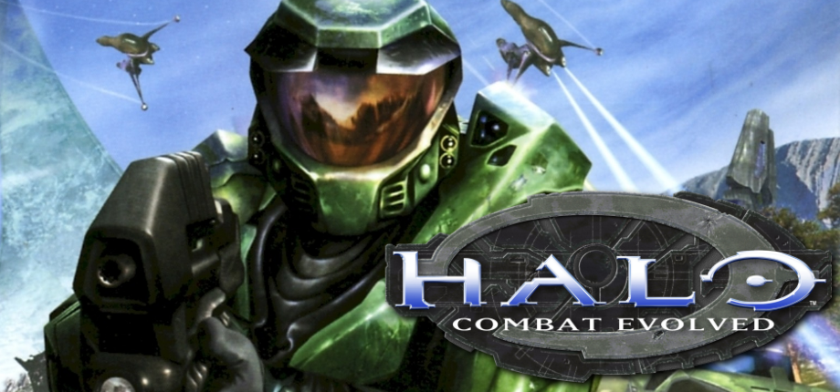 **Halo: Combat Evolved** | [Halo CE Quest VR + Android](https://github.com/moistman42069/HaloCE-Quest-VR) by [moistman42069](https://github.com/moistman42069) Latest: [v1.0.18](https://github.com/moistman42069/HaloCE-Quest-VR/releases/latest) (2026-10-08) | Standalone 🚧 beta | — |
|  **Halo: Combat Evolved (PC)** | [HaloCEVR](https://github.com/LivingFray/HaloCEVR) by [LivingFray](https://github.com/LivingFray) Latest: [1.4.0](https://github.com/LivingFray/HaloCEVR/releases/latest) (2026-01-10) | PCVR ✅ stable 10 known bugs | [▶ Beardo Benjo](https://www.youtube.com/watch?v=KV-SMBYu7IY) [▶ Tyriel Wood - VR Tech](https://www.youtube.com/watch?v=zUMakbVleso) |
| 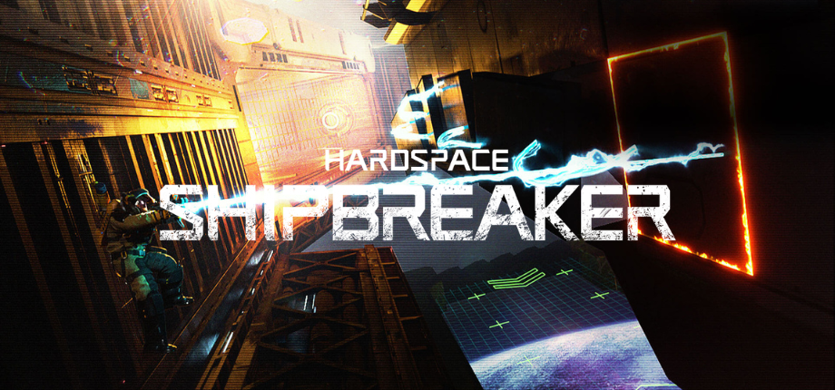 **Hardspace: Shipbreaker** | [ShipbreakerVR](https://raicuparta.com/shipbreaker-vr-mod) by [Rai](https://raicuparta.com/shipbreaker-vr-mod) Latest: [unversioned](https://raicuparta.com/shipbreaker-vr-mod) (2026-10-09) | PCVR 🚧 beta 1 known bug | [▶ Raicuparta](https://www.youtube.com/watch?v=UGGtz1lYMNw) [▶ Paradise Decay](https://www.youtube.com/watch?v=PZLhq5NiFKo) |
| 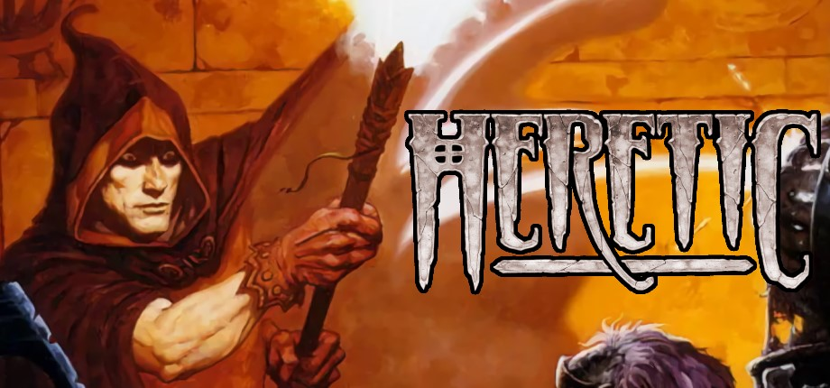 **Heretic** | [QuestZDoom](https://github.com/Team-Beef-Studios/QuestZDoom) by [Team Beef](https://github.com/Team-Beef-Studios) Latest: [1.6.2](https://github.com/Team-Beef-Studios/QuestZDoom/releases/latest) (2026-09-30) | Standalone ✅ stable | [▶ Beardo Benjo](https://www.youtube.com/watch?v=YelM8MdzzpI) [▶ VR Reviews](https://www.youtube.com/watch?v=LwT1aKRGcOA) |
| 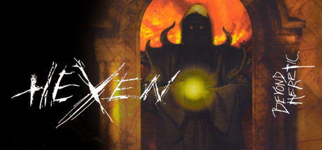 **Hexen** | [QuestZDoom](https://github.com/Team-Beef-Studios/QuestZDoom) by [Team Beef](https://github.com/Team-Beef-Studios) Latest: [1.6.2](https://github.com/Team-Beef-Studios/QuestZDoom/releases/latest) (2026-09-30) | Standalone ✅ stable | [▶ Beardo Benjo](https://www.youtube.com/watch?v=YelM8MdzzpI) [▶ VR Reviews](https://www.youtube.com/watch?v=LwT1aKRGcOA) |
| 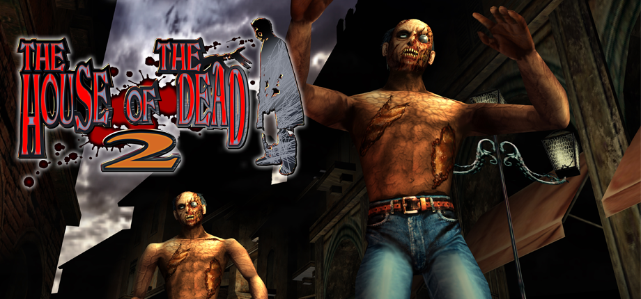 **The House of the Dead 2** | [The House of the Dead 2 VR](https://github.com/mikermak/hotd2-vr) by [mikermak](https://github.com/mikermak) Latest: [v0.3-test1](https://github.com/mikermak/hotd2-vr/releases/latest) (2026-10-09) | PCVR + Standalone 🧪 alpha 2 known bugs | [▶ Retroid](https://www.youtube.com/watch?v=A7b83PHgRB8) [▶ VR in EVERYTHING](https://www.youtube.com/watch?v=MkmQsxcIMLc) |
| 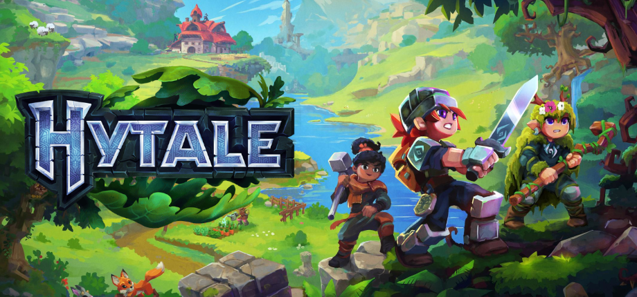 **Hytale** | [Hytale VR Injector](https://github.com/heurazy/HytaleVRInjector-mod) by [heurazy](https://github.com/heurazy) Latest: [v1.0.4](https://github.com/heurazy/HytaleVRInjector-mod/releases/latest) (2026-08-24) | PCVR 🚧 beta | [▶ Muntan](https://www.youtube.com/watch?v=Kg0P_mDJoTo) |
|  **IL-2 Sturmovik: 1946** | [IL-2 Sturmovik: 1946 VR](https://www.sas1946.com/main/index.php/topic,75791.0.html) by boilingMetal, firepolo Latest: [unversioned](https://www.sas1946.com/main/index.php/topic,75791.0.html) (2026-08-09) | PCVR 🧪 alpha | [▶ Xiao Wen](https://www.youtube.com/watch?v=MYpE9PPb49k) [▶ Xiao Wen](https://www.youtube.com/watch?v=MdMiA-GprkE) |
| 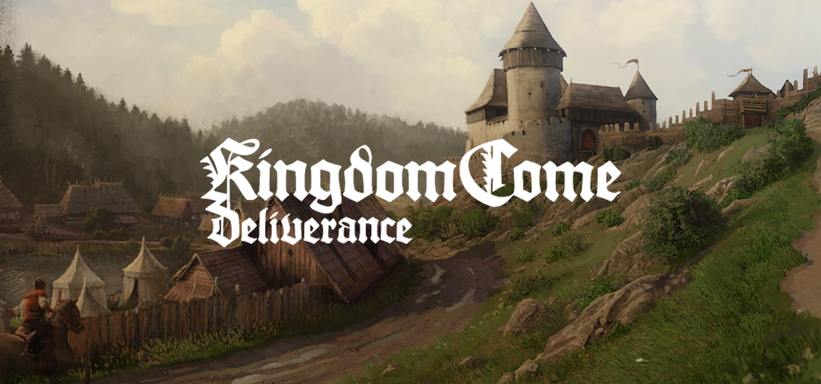 **Kingdom Come: Deliverance** | [KCD1VR](https://github.com/farmerarmor/KCD1VR) by [farmerarmor](https://github.com/farmerarmor) Latest: [v0.1.69](https://github.com/farmerarmor/KCD1VR/releases/latest) (2026-09-26) | PCVR 🧪 alpha 6 known bugs | [▶ Sweet Beans](https://www.youtube.com/watch?v=O1C_DT_P3oE) [▶ FastLawyer](https://www.youtube.com/watch?v=bEemOkchFGU) |
| 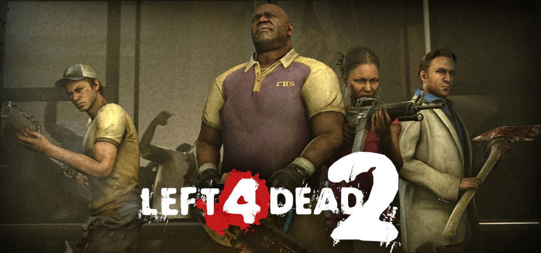 **Left 4 Dead 2** | [L4D2VR](https://github.com/sd805/l4d2vr) by [sd805](https://github.com/sd805), MasterMind420 Latest: [0.6.2](https://github.com/sd805/l4d2vr/releases/latest) (2025-07-19) | PCVR 🧪 alpha 3 known bugs | [▶ Ace TheOcarinaMaker](https://www.youtube.com/watch?v=RiUE3ImEBT4) [▶ Shaak4 VR](https://www.youtube.com/watch?v=Yb_JfxGoWms) |
| 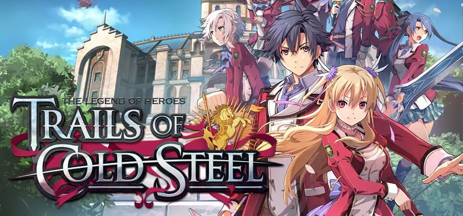 **The Legend of Heroes: Trails of Cold Steel** | [Trails of Cold Steel VR](https://github.com/petonexus/tocs-vr-releases) by [petonexus](https://github.com/petonexus) Latest: [v0.1.0-alpha.3](https://github.com/petonexus/tocs-vr-releases/releases/latest) (2026-10-08) | PCVR 🧪 alpha 1 known bug | — |
| 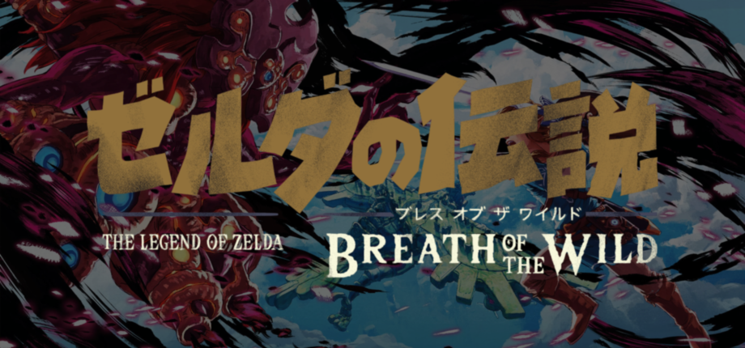 **The Legend of Zelda: Breath of the Wild** | [BetterVR](https://github.com/Crementif/BotW-BetterVR) by [Crementif](https://github.com/Crementif) Latest: [0.9.23](https://github.com/Crementif/BotW-BetterVR/releases/latest) (2026-08-24) | PCVR 🚧 beta 4 known bugs | [▶ GSpider Extras](https://www.youtube.com/watch?v=RiqP97-nGbw) [▶ Alexander Goncharov](https://www.youtube.com/watch?v=6usdDChC3xE) |
| 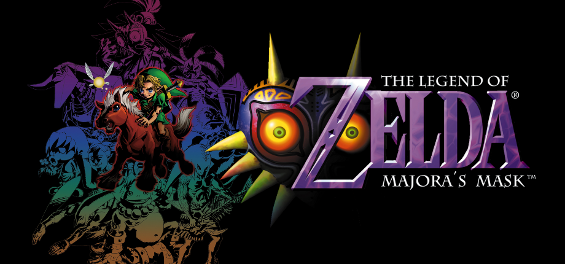 **The Legend of Zelda: Majora's Mask** | [Majora's Mask VR](https://github.com/fulldivegames/Majoras-Mask-VR) by [FullDiveGames](https://github.com/fulldivegames) Latest: [v0.35](https://github.com/fulldivegames/Majoras-Mask-VR/releases/latest) (2026-10-08) | PCVR + Standalone 🚧 beta 1 known bug | [▶ FullDiveGames](https://www.youtube.com/watch?v=LC08Rpj-5xc) [▶ FullDiveGames](https://www.youtube.com/watch?v=MJuM7PrNoK0) |
|  **The Legend of Zelda: Ocarina of Time** | [oot-vr](https://github.com/gibranfelix/oot-vr) by [gibranfelix](https://github.com/gibranfelix) Latest: [v0.4.0-alpha](https://github.com/gibranfelix/oot-vr/releases/latest) (2026-10-09) | Standalone 🧪 alpha | [▶ Reallycoolguy55](https://www.youtube.com/watch?v=Y9PKeWhd6as) |
| 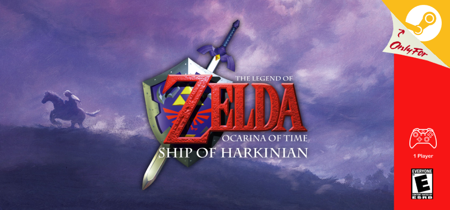 **The Legend of Zelda: Ocarina of Time** | [Shipwright-VR](https://github.com/ShinyWindow/Shipwright-VR) by [ShinyWindow](https://github.com/ShinyWindow) Latest: [v1.4.1](https://github.com/ShinyWindow/Shipwright-VR/releases/latest) (2026-10-06) | PCVR + Standalone 🚧 beta | [▶ legaiaflame](https://www.youtube.com/watch?v=IZRvTBmzS-4) [▶ Dyno Mike Gaming](https://www.youtube.com/watch?v=jnuR13guRAk) |
| 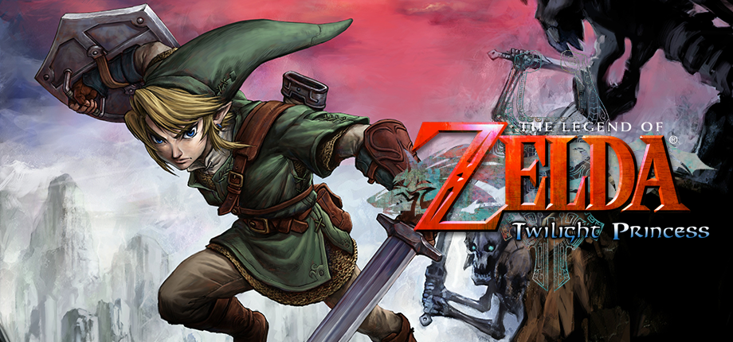 **The Legend of Zelda: Twilight Princess** | [Dusk VR](https://github.com/provencher/dusk-vr) by [provencher](https://github.com/provencher) Latest: [unversioned](https://github.com/provencher/dusk-vr) (2026-10-09) | PCVR 🧪 alpha | [▶ legaiaflame](https://www.youtube.com/watch?v=t9OfB7FwT4Q) [▶ legaiaflame](https://www.youtube.com/watch?v=sugca8IC4ac) |
| 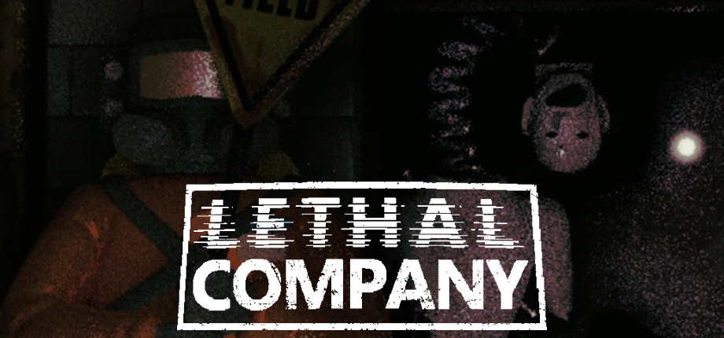 **Lethal Company** | [LethalCompanyVR (LCVR)](https://github.com/DaXcess/LCVR) by [DaXcess](https://github.com/DaXcess) Latest: [v1.5.0](https://github.com/DaXcess/LCVR/releases/latest) (2026-04-14) | PCVR ✅ stable | [▶ BamBaeYoh](https://www.youtube.com/watch?v=W-z03H3Yo5E) [▶ Jameskii](https://www.youtube.com/watch?v=mASgCcYJHNk) |
|  **Mario Kart Wii** | [Wiicompiled VR](https://github.com/iChris4/Wiicompiled_VR) by [iChris4](https://github.com/iChris4) Latest: [0.2.45](https://github.com/iChris4/Wiicompiled_VR/releases/latest) (2026-09-30) | PCVR 🧪 alpha 2 known bugs | [▶ Poofesure](https://www.youtube.com/watch?v=2D5KLLdZxPk) [▶ TWD98](https://www.youtube.com/watch?v=gQrwLvBTyN8) |
| 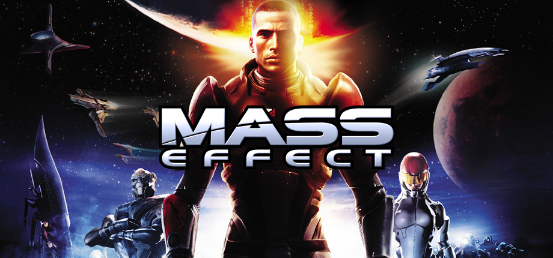 **Mass Effect (Legendary Edition)** | [Mass Effect Legendary Edition VR](https://www.patreon.com/dhalcyon/posts/suicide-mission-165506412) by dhalcyon Latest: [unversioned](https://www.patreon.com/dhalcyon/posts/suicide-mission-165506412) (2026-08-01) | PCVR 🧪 alpha | [▶ Beardo Benjo](https://www.youtube.com/watch?v=K-z0tIGgJag) [▶ Headset-VR](https://www.youtube.com/watch?v=tFHrf8v_uUY) |
| 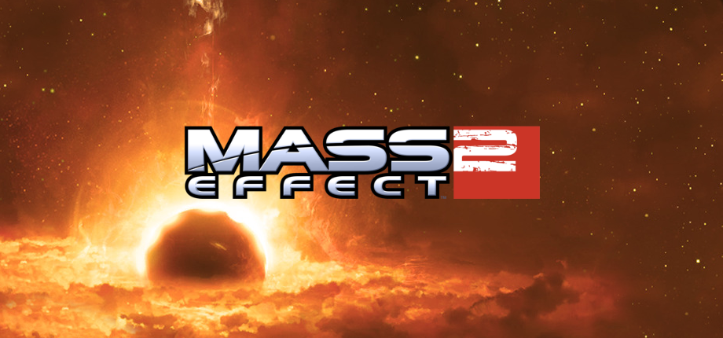 **Mass Effect 2 (Legendary Edition)** | [Mass Effect Legendary Edition VR](https://www.patreon.com/dhalcyon/posts/suicide-mission-165506412) by dhalcyon Latest: [unversioned](https://www.patreon.com/dhalcyon/posts/suicide-mission-165506412) (2026-08-01) | PCVR 🧪 alpha | [▶ Beardo Benjo](https://www.youtube.com/watch?v=K-z0tIGgJag) [▶ Headset-VR](https://www.youtube.com/watch?v=tFHrf8v_uUY) |
|  **The Maze of the Kings** | [The House of the Dead 2 VR](https://github.com/mikermak/hotd2-vr) by [mikermak](https://github.com/mikermak) Latest: [v0.3-test1](https://github.com/mikermak/hotd2-vr/releases/latest) (2026-10-09) | PCVR + Standalone 🧪 alpha 2 known bugs | [▶ Retroid](https://www.youtube.com/watch?v=A7b83PHgRB8) [▶ VR in EVERYTHING](https://www.youtube.com/watch?v=MkmQsxcIMLc) |
| 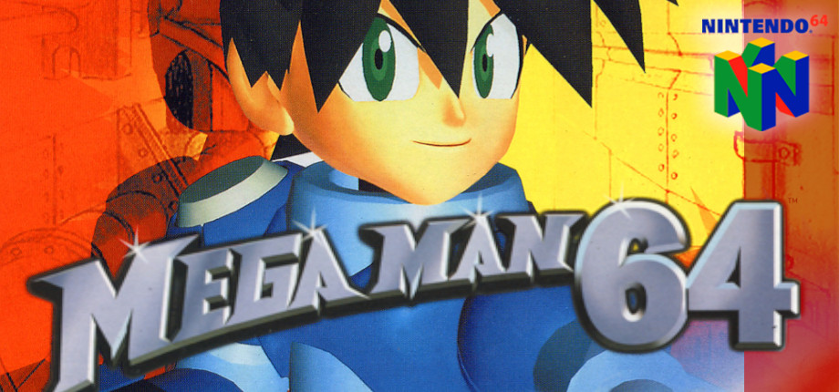 **Mega Man 64** | [MegaMan64RecompiledVR](https://github.com/randygil/MegaMan64RecompiledVR) by [randygil](https://github.com/randygil) Latest: [v0.9.1-vr1](https://github.com/randygil/MegaMan64RecompiledVR/releases/latest) (2026-10-01) | PCVR + Standalone 🚧 beta | — |
|  **Metroid Prime** | [MetroidPrimePortVR (PrimedGun v2)](https://github.com/iChris4/MetroidPrimePortVR) by [iChris4](https://github.com/iChris4), Odran (Odrannnn), Nobbie248 Latest: [v2.0.0-alpha.2](https://github.com/iChris4/MetroidPrimePortVR/releases/latest) (2026-10-08) | PCVR + Standalone 🧪 alpha | [▶ Beardo Benjo](https://www.youtube.com/watch?v=iWS_krcirCw) [▶ Beardo Benjo](https://www.youtube.com/watch?v=--05XNl9YaU) |
|  **Metroid Prime** | [PrimedGun](https://github.com/Nobbie248/PrimedGun) by [Nobbie248](https://github.com/Nobbie248) Latest: [v1.1.7-windows](https://github.com/Nobbie248/PrimedGun/releases/latest) (2026-10-05) | PCVR + Standalone ✅ stable 1 known bug | [▶ Beardo Benjo](https://www.youtube.com/watch?v=iWS_krcirCw) [▶ Beardo Benjo](https://www.youtube.com/watch?v=--05XNl9YaU) |
| 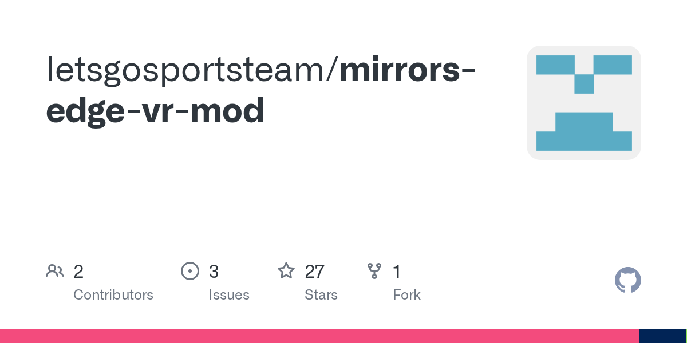 **Mirror's Edge (2008)** | [Mirror's Edge VR](https://github.com/letsgosportsteam/mirrors-edge-vr-mod) by [LetsGoSportsTeam](https://github.com/letsgosportsteam) Latest: [v0.2.2-alpha](https://github.com/letsgosportsteam/mirrors-edge-vr-mod/releases/latest) (2026-09-19) | PCVR 🧪 alpha 3 known bugs | — |
|  **Neon White** | [HeavenVR](https://raicuparta.com/neon-white-vr-mod) by Rai Latest: [unversioned](https://raicuparta.com/neon-white-vr-mod) (2026-10-09) | PCVR 🧪 alpha | [▶ Eurogamer](https://www.youtube.com/watch?v=DrwI5f5qqpM) [▶ Raicuparta](https://www.youtube.com/watch?v=zC-k2HTqg1A) |
|  **Nuclear Option** | [NOVR](https://github.com/InfernoSuperNova/novr) by [InfernoSuperNova](https://github.com/InfernoSuperNova) Latest: [0.4.4](https://github.com/InfernoSuperNova/novr/releases/latest) (2026-09-09) | PCVR 🚧 beta | [▶ Enigma](https://www.youtube.com/watch?v=Ojqd0oC2c8U) [▶ TacJackal](https://www.youtube.com/watch?v=IDMlU4DRcRI) |
| 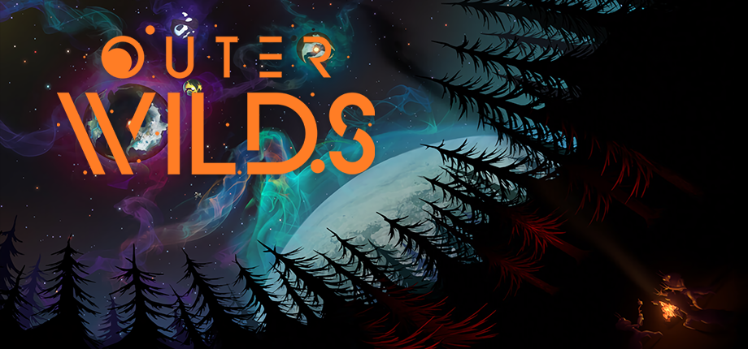 **Outer Wilds** | [NomaiVR](https://github.com/Raicuparta/nomai-vr) by [Raicuparta](https://raicuparta.com) Latest: [2.10.0](https://github.com/Raicuparta/nomai-vr/releases/latest) (2025-03-02) | PCVR ✅ stable | [▶ The Librarian](https://www.youtube.com/watch?v=cq57e2qPGdE) [▶ Mick  Manchester. ](https://www.youtube.com/watch?v=5CVvjLiw5VU) |
| 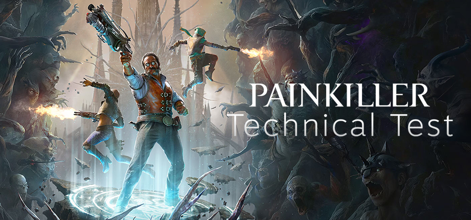 **PainKiller** | [PainKiller VR Mod](https://github.com/FluorescentHallucinogen/painkiller-vr-mod) by [FluorescentHallucinogen](https://github.com/FluorescentHallucinogen) Latest: [v0.1.9](https://github.com/FluorescentHallucinogen/painkiller-vr-mod/releases/latest) (2026-09-07) | PCVR 🚧 beta | [▶ Beardo Benjo](https://www.youtube.com/watch?v=IJg0zG5ViEM) [▶ Pavel419](https://www.youtube.com/watch?v=s469AllzjEc) |
| 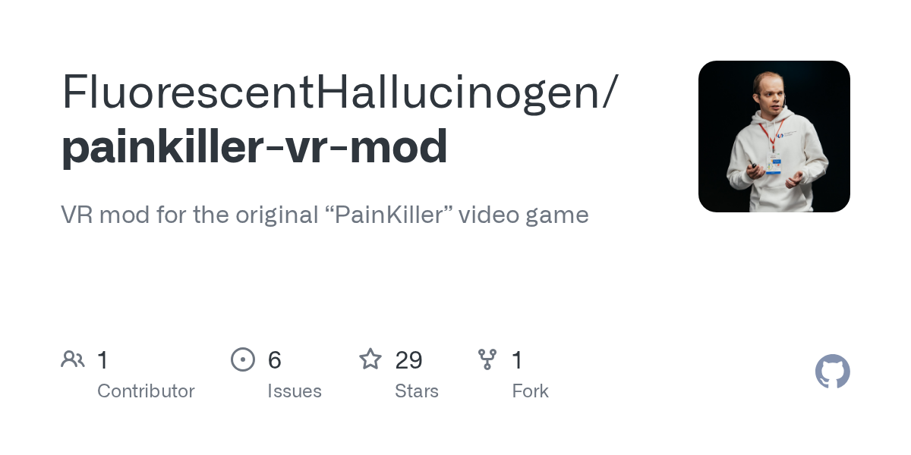 **PainKiller: Battle Out of Hell** | [PainKiller VR Mod](https://github.com/FluorescentHallucinogen/painkiller-vr-mod) by [FluorescentHallucinogen](https://github.com/FluorescentHallucinogen) Latest: [v0.1.9](https://github.com/FluorescentHallucinogen/painkiller-vr-mod/releases/latest) (2026-09-07) | PCVR 🚧 beta | [▶ Beardo Benjo](https://www.youtube.com/watch?v=IJg0zG5ViEM) [▶ Pavel419](https://www.youtube.com/watch?v=s469AllzjEc) |
| 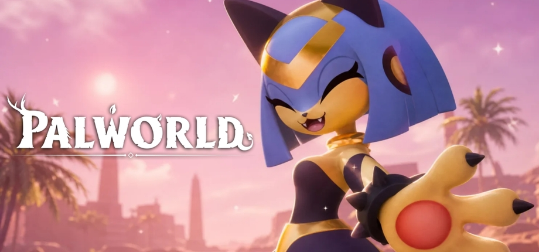 **Palworld** | [Palworld UEVR](https://www.patreon.com/D_Rey/posts/palworld-uevr-165894175) by D_Rey Latest: [unversioned](https://www.patreon.com/D_Rey/posts/palworld-uevr-165894175) (2026-07-26) | PCVR ✅ stable | [▶ Beardo Benjo](https://www.youtube.com/watch?v=i5OYgdTQSWI) [▶ ThisKory](https://www.youtube.com/watch?v=QV7U1btgztY) |
|  **PAYDAY 2** | [VR: Improvements Mod / VR+ (VR Plus) Continued](https://github.com/DennisGHUA/payday2-vr-improvements) by [DennisGHUA](https://github.com/DennisGHUA) Latest: [v0.8.8](https://github.com/DennisGHUA/payday2-vr-improvements/releases/latest) (2026-08-29) | PCVR 🚧 beta | [▶ Helixxvr](https://www.youtube.com/watch?v=fG8JXcdZ25M) [▶ Frontways Larry](https://www.youtube.com/watch?v=405RhWEMAK8) |
| 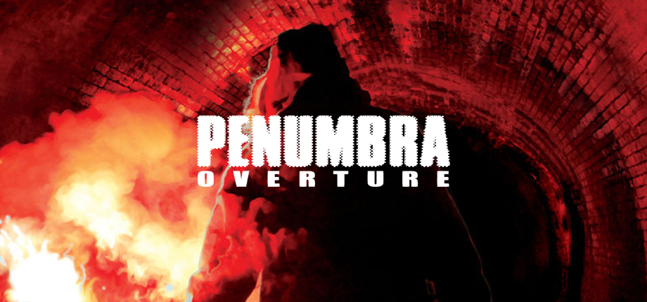 **Penumbra: Overture** | [Penumbra: Overture VR Mod](https://github.com/newyork167/penumbra_vr) by [newyork167](https://github.com/newyork167) Latest: [untagged-aceffe2e650abce1e795](https://github.com/newyork167/penumbra_vr/releases/latest) (2018-06-23) | PCVR 💀 abandoned | [▶ znmcys](https://www.youtube.com/watch?v=TMbIcwtcTWA) [▶ SweViver](https://www.youtube.com/watch?v=qT3Y5dZ-nLg) |
| 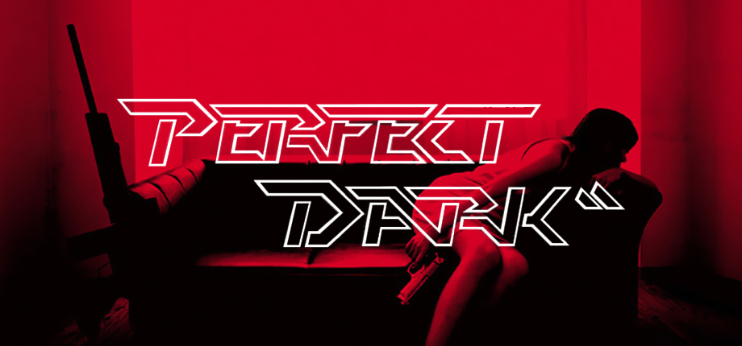 **Perfect Dark** | [Perfect Dark VR](https://github.com/Alex-LeTux/perfect_dark_VR) by [Alex Le Tux](https://github.com/Alex-LeTux) Latest: [v2.0](https://github.com/Alex-LeTux/perfect_dark_VR/releases/latest) (2026-10-07) | PCVR + Standalone 🚧 beta | [▶ Graslu00](https://www.youtube.com/watch?v=wkQiyeYn7QU) [▶ A Wolf in VR](https://www.youtube.com/watch?v=APpDgSHR-b0) |
|  **Pokemon Blue** | [1GenPokemonVR](https://github.com/heurazy/1genpokemonvr) by [heurazy](https://github.com/heurazy) Latest: [v0.2.46](https://github.com/heurazy/1GenPokemonVr/releases/latest) (2026-08-10) | PCVR + Standalone 🧪 alpha | — |
| 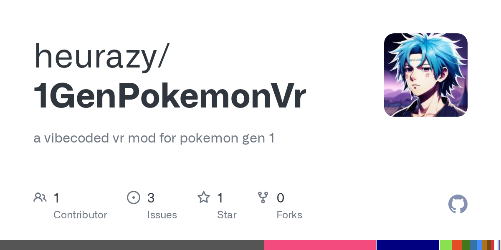 **Pokemon Red** | [1GenPokemonVR](https://github.com/heurazy/1genpokemonvr) by [heurazy](https://github.com/heurazy) Latest: [v0.2.46](https://github.com/heurazy/1GenPokemonVr/releases/latest) (2026-08-10) | PCVR + Standalone 🧪 alpha | — |
| 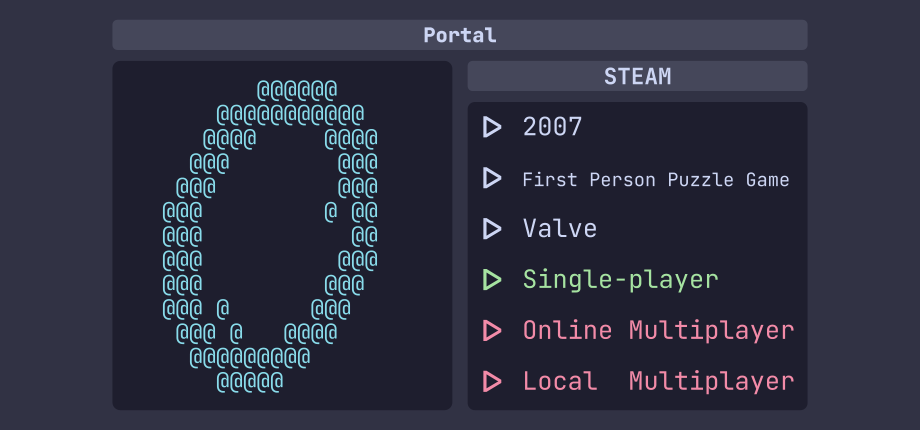 **Portal** | [SourceVR](https://github.com/tinsarfal/SourceVR) by [tinsarfal](https://github.com/tinsarfal) Latest: [0.1.28](https://github.com/tinsarfal/SourceVR/releases/latest) (2026-10-02) | Standalone 🚧 beta | [▶ LunchAndVR](https://www.youtube.com/watch?v=QzgDw8xEpeM) [▶ LunchAndVR](https://www.youtube.com/watch?v=kR_z39AJ-PQ) |
| 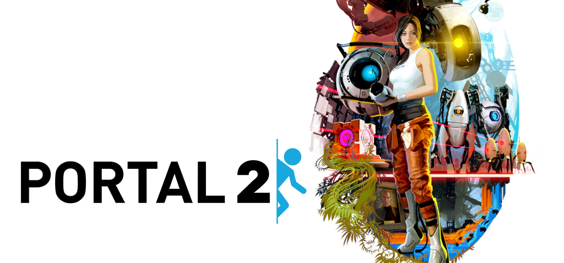 **Portal 2** | [SourceVR](https://github.com/tinsarfal/SourceVR) by [tinsarfal](https://github.com/tinsarfal) Latest: [0.1.28](https://github.com/tinsarfal/SourceVR/releases/latest) (2026-10-02) | Standalone 🚧 beta | [▶ LunchAndVR](https://www.youtube.com/watch?v=QzgDw8xEpeM) [▶ LunchAndVR](https://www.youtube.com/watch?v=kR_z39AJ-PQ) |
| 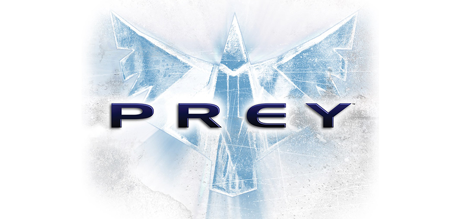 **Prey (2006)** | [PreyVR](https://github.com/Team-Beef-Studios/PreyVR) by lvonasek, [Team-Beef-Studios](https://github.com/Team-Beef-Studios) Latest: [v1.2.4](https://github.com/Team-Beef-Studios/PreyVR/releases/latest) (2026-03-24) | Standalone ✅ stable | [▶ VRified Games](https://www.youtube.com/watch?v=5TwIxB0oKd8) [▶ JORDAN VR180](https://www.youtube.com/watch?v=x2vvayN7MXA) |
|  **Quake** | [QuakeQuest](https://github.com/Team-Beef-Studios/QuakeQuest) by [Team Beef](https://github.com/Team-Beef-Studios) Latest: [v1.6.0](https://github.com/Team-Beef-Studios/QuakeQuest/releases/latest) (2026-09-29) | Standalone ✅ stable | [▶ RaMarcus](https://www.youtube.com/watch?v=Lof2hd9DymQ) [▶ TechHoller](https://www.youtube.com/watch?v=ChXSfe7_eMI) |
| 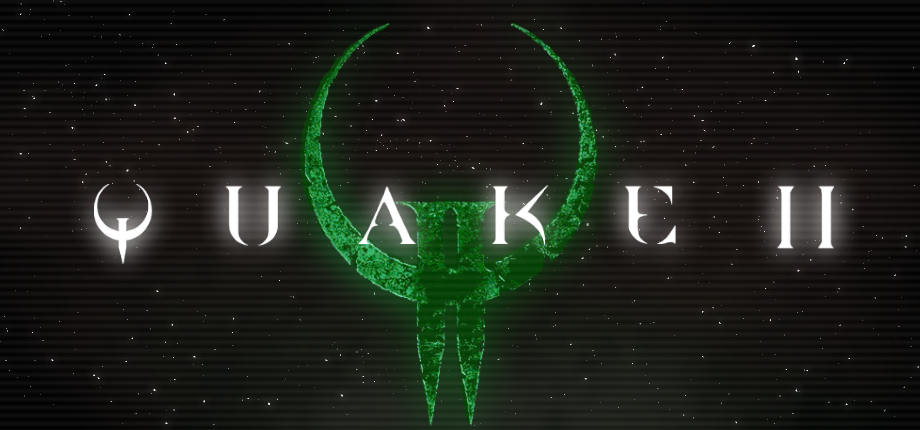 **Quake II** | [Quake2Quest](https://github.com/Team-Beef-Studios/Quake2Quest) by [Team Beef](https://github.com/Team-Beef-Studios) Latest: [v1.1.1](https://github.com/Team-Beef-Studios/Quake2Quest/releases/latest) (2026-09-29) | Standalone ✅ stable | [▶ DoomSly82](https://www.youtube.com/watch?v=PlvkJJvEKKE) [▶ Team Beef VR Game Ports](https://www.youtube.com/watch?v=xqDJtjeYo4k) |
| 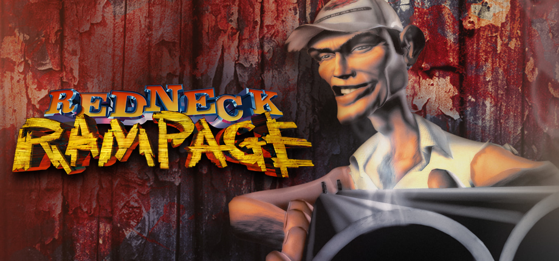 **Redneck Rampage** | [RazeXR](https://github.com/Team-Beef-Studios/RazeXR) by [Team Beef](https://github.com/Team-Beef-Studios) Latest: [v1.0.0](https://github.com/Team-Beef-Studios/RazeXR/releases/latest) (2023-09-30) | Standalone ✅ stable | [▶ VR Reviews](https://www.youtube.com/watch?v=dFiVi_xUjRc) [▶ VoodooDE VR](https://www.youtube.com/watch?v=h5vjhgyeNiE) |
| 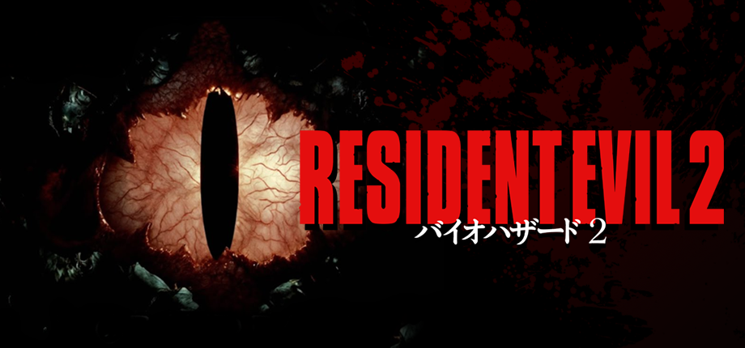 **Resident Evil 2 (2019)** | [REFramework](https://github.com/praydog/REFramework) by [praydog](https://github.com/praydog) Latest: [v1.5.9.1](https://github.com/praydog/REFramework/releases/latest) (2025-03-05) | PCVR ✅ stable | [▶ MRTV - MIXED REALITY TV](https://www.youtube.com/watch?v=hySd4sHtcDE) [▶ Stereo3DProductions](https://www.youtube.com/watch?v=Ql5ggETipyM) |
| 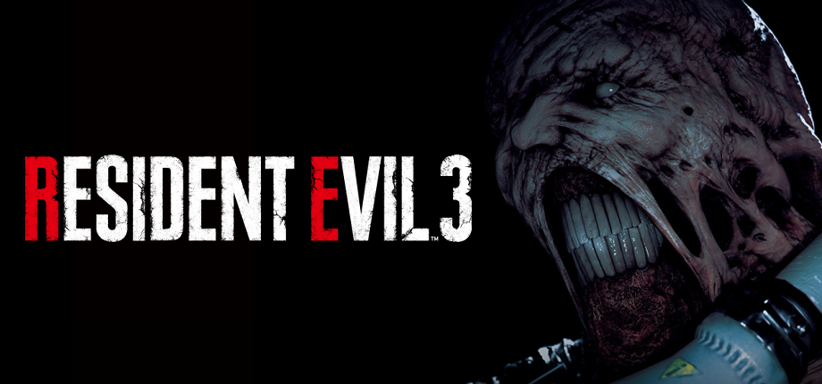 **Resident Evil 3 (2020)** | [REFramework](https://github.com/praydog/REFramework) by [praydog](https://github.com/praydog) Latest: [v1.5.9.1](https://github.com/praydog/REFramework/releases/latest) (2025-03-05) | PCVR ✅ stable | [▶ MRTV - MIXED REALITY TV](https://www.youtube.com/watch?v=hySd4sHtcDE) [▶ Stereo3DProductions](https://www.youtube.com/watch?v=Ql5ggETipyM) |
| 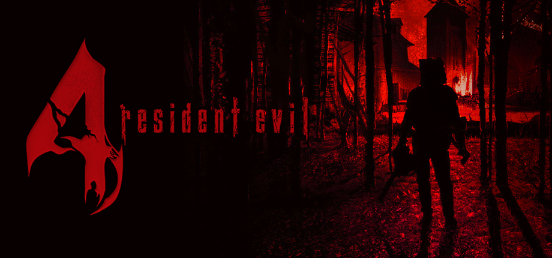 **Resident Evil 4 (2023)** | [REFramework](https://github.com/praydog/REFramework) by [praydog](https://github.com/praydog) Latest: [v1.5.9.1](https://github.com/praydog/REFramework/releases/latest) (2025-03-05) | PCVR ✅ stable | [▶ MRTV - MIXED REALITY TV](https://www.youtube.com/watch?v=hySd4sHtcDE) [▶ Stereo3DProductions](https://www.youtube.com/watch?v=Ql5ggETipyM) |
| 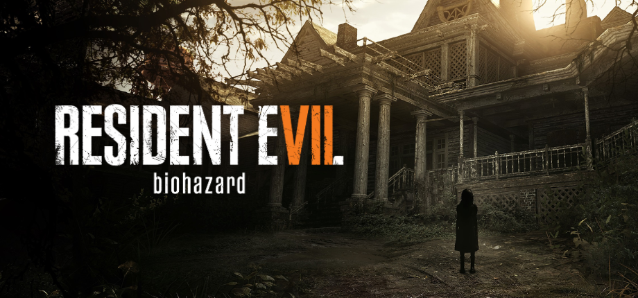 **Resident Evil 7** | [REFramework](https://github.com/praydog/REFramework) by [praydog](https://github.com/praydog) Latest: [v1.5.9.1](https://github.com/praydog/REFramework/releases/latest) (2025-03-05) | PCVR ✅ stable | [▶ MRTV - MIXED REALITY TV](https://www.youtube.com/watch?v=hySd4sHtcDE) [▶ Stereo3DProductions](https://www.youtube.com/watch?v=Ql5ggETipyM) |
|  **Resident Evil Village** | [REFramework](https://github.com/praydog/REFramework) by [praydog](https://github.com/praydog) Latest: [v1.5.9.1](https://github.com/praydog/REFramework/releases/latest) (2025-03-05) | PCVR ✅ stable | [▶ MRTV - MIXED REALITY TV](https://www.youtube.com/watch?v=hySd4sHtcDE) [▶ Stereo3DProductions](https://www.youtube.com/watch?v=Ql5ggETipyM) |
|  **Return to Castle Wolfenstein** | [RTCWQuest](https://github.com/Team-Beef-Studios/RTCWQuest) by [Team Beef](https://github.com/Team-Beef-Studios) Latest: [v1.4.1](https://github.com/Team-Beef-Studios/RTCWQuest/releases/latest) (2026-09-29) | Standalone ✅ stable | [▶ Pure Play TV](https://www.youtube.com/watch?v=kZJNHJdbBkU) [▶ GameCubits](https://www.youtube.com/watch?v=RIIGMVAeM-M) |
| 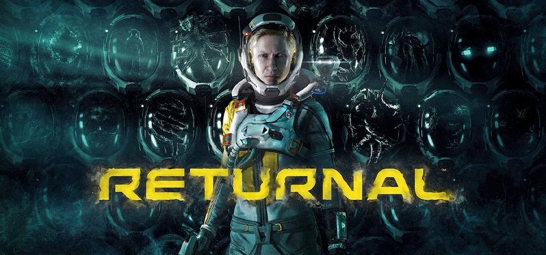 **Returnal** | [Returnal UEVR](https://github.com/letmein-vr/RETURNAL_UEVR) by [letmein-vr](https://github.com/letmein-vr) Latest: [1.2_IK](https://github.com/letmein-vr/RETURNAL_UEVR/releases/latest) (2026-08-01) | PCVR ✅ stable 4 known bugs | [▶ Gamertag VR](https://www.youtube.com/watch?v=hb3am-poQ9U) [▶ Waifu Enjoyer](https://www.youtube.com/watch?v=_1wjU3rwi78) |
| 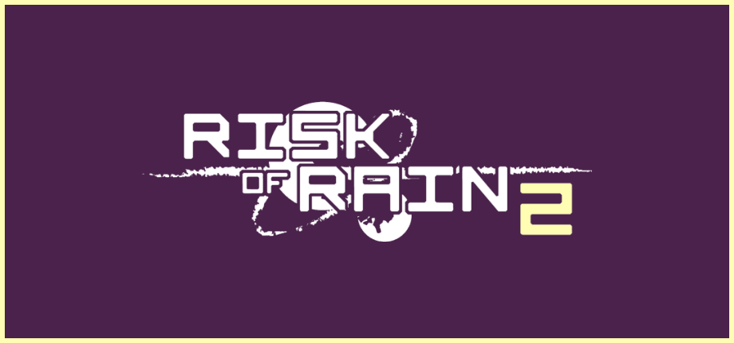 **Risk of Rain 2** | [VRMod](https://github.com/DrBibop/RoR2VRMod) by [DrBibop](https://github.com/DrBibop) Latest: [2.9.2](https://thunderstore.io/package/DrBibop/VRMod/) (2022-06-15) | PCVR 💀 abandoned | [▶ rndThursday](https://www.youtube.com/watch?v=lh_9fsh_OvA) [▶ Beardo Benjo](https://www.youtube.com/watch?v=wV1_MFR_JfI) |
| 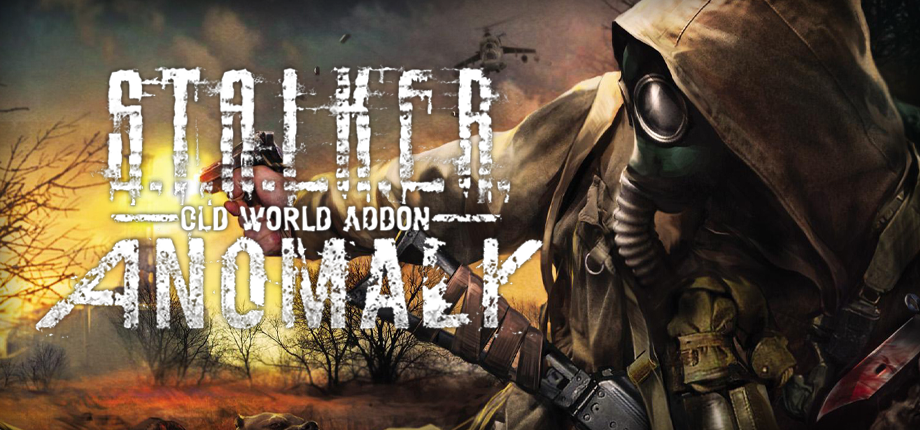 **S.T.A.L.K.E.R. Anomaly** | [S.T.A.L.K.E.R. Anomaly VR](https://ap-pro.ru/forums/topic/14575-anomaly-vr/) by MarsyApp Latest: [0.4.5](https://ap-pro.ru/forums/topic/14575-anomaly-vr/) (2026-05-09) | PCVR 🧪 alpha | [▶ Anomaly VR (Андрей MarsyApp)](https://www.youtube.com/watch?v=IIQGMCltW2M) [▶ Anomaly VR (Андрей MarsyApp)](https://www.youtube.com/watch?v=LhODMRyRGpk) |
|  **Scrap Mechanic** | [Scrap Mechanic Native VR](https://github.com/21Suspect/Scrap-Mechanic-Native-VR) by [21Suspect](https://github.com/21Suspect) Latest: [v1.4.8](https://github.com/21Suspect/Scrap-Mechanic-Native-VR/releases/latest) (2026-09-08) | PCVR ✅ stable | [▶ U W I P](https://www.youtube.com/watch?v=FpFTF14iAb8) [▶ U W I P](https://www.youtube.com/watch?v=0RnKR7LIPsY) |
| 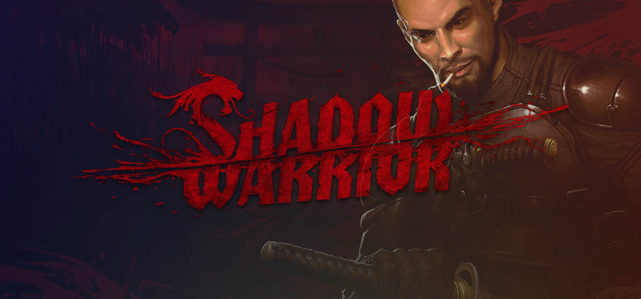 **Shadow Warrior** | [RazeXR](https://github.com/Team-Beef-Studios/RazeXR) by [Team Beef](https://github.com/Team-Beef-Studios) Latest: [v1.0.0](https://github.com/Team-Beef-Studios/RazeXR/releases/latest) (2023-09-30) | Standalone ✅ stable | [▶ VR Reviews](https://www.youtube.com/watch?v=dFiVi_xUjRc) [▶ VoodooDE VR](https://www.youtube.com/watch?v=h5vjhgyeNiE) |
| 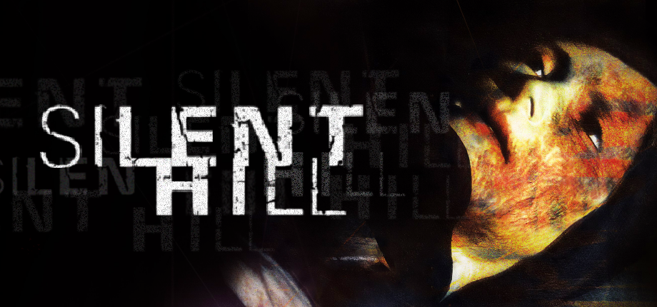 **Silent Hill (1999)** | [Silent Hill (1999) VR](https://www.patreon.com/u61517070/posts/silent-hill-1999-165598817) by VRified Games Latest: [unversioned](https://www.patreon.com/u61517070/posts/silent-hill-1999-165598817) (2026-08-02) | PCVR 🧪 alpha 1 known bug | [▶ Dredile](https://www.youtube.com/watch?v=PzReMsIgpOU) [▶ Silent Archives](https://www.youtube.com/watch?v=QXGVqJjTLoU) |
|  **Sonic Robo Blast 2** | [Sonic Robo Blast 2 VR](https://github.com/RaYRoD-TV/MVRH) by RaYRoD-TV Latest: [Patch 2](https://github.com/RaYRoD-TV/MVRH/releases) (2026-10-09) | PCVR 🧪 alpha | [▶ Team Beef VR Game Ports](https://www.youtube.com/watch?v=3Dcczzud7Tc) [▶ legaiaflame](https://www.youtube.com/watch?v=zZoC6sKsX9U) |
| 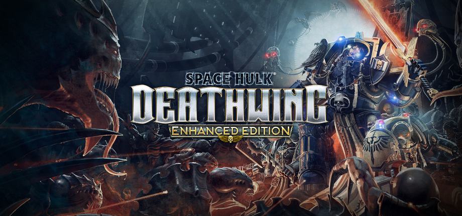 **Space Hulk: Deathwing Enhanced Edition** | [Space Hulk: Deathwing VR](https://github.com/helpimaghost/Space-Hulk-Deathwing-VR) by [help im a ghost](https://github.com/helpimaghost), Pande4360 Latest: [1.12](https://github.com/helpimaghost/Space-Hulk-Deathwing-VR/releases/latest) (2026-10-03) | PCVR ✅ stable 4 known bugs | [▶ help im a ghost](https://www.youtube.com/watch?v=FINK6QAYO50) |
| 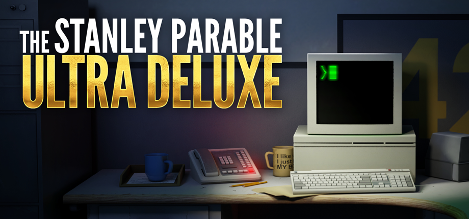 **The Stanley Parable: Ultra Deluxe** | [Stanley VR](https://github.com/Raicuparta/stanley-vr) by [Raicuparta](https://raicuparta.com) Latest: [v0.4.0](https://github.com/Raicuparta/stanley-vr/releases/latest) (2023-04-10) | PCVR 🚧 beta | [▶ Hoshi82](https://www.youtube.com/watch?v=vZ0oBfZNDAY) [▶ Headset-VR](https://www.youtube.com/watch?v=EFGV25MsUGA) |
| 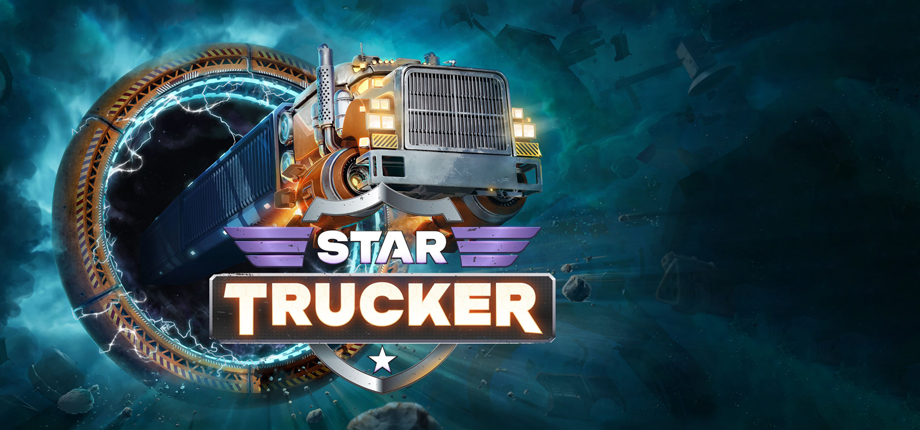 **Star Trucker** | [Star Trucker VR](https://www.nexusmods.com/startrucker/mods/17) by Svveepa Latest: [1.0](https://www.nexusmods.com/startrucker/mods/17) (2026-07-20) | PCVR ✅ stable 1 known bug | — |
| 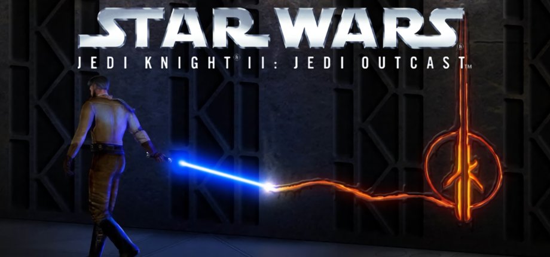 **Star Wars Jedi Knight II: Jedi Outcast** | [JKXR](https://github.com/Team-Beef-Studios/JKXR) by [Team Beef](https://github.com/Team-Beef-Studios) Latest: [v1.2.0](https://github.com/Team-Beef-Studios/JKXR/releases/latest) (2026-09-29) | PCVR + Standalone ✅ stable | [▶ fornix VR](https://www.youtube.com/watch?v=powgjtFAsyg) |
| 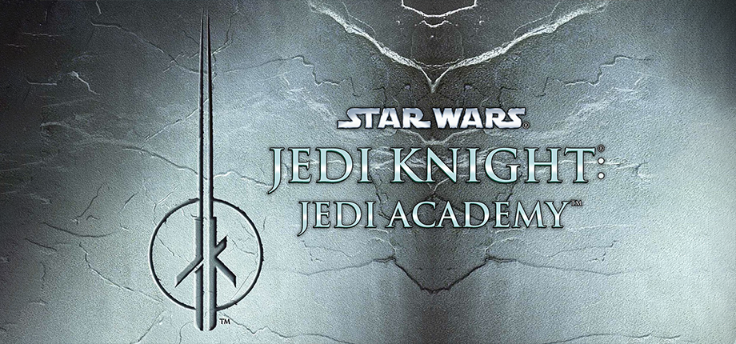 **Star Wars Jedi Knight: Jedi Academy** | [JKXR](https://github.com/Team-Beef-Studios/JKXR) by [Team Beef](https://github.com/Team-Beef-Studios) Latest: [v1.2.0](https://github.com/Team-Beef-Studios/JKXR/releases/latest) (2026-09-29) | PCVR + Standalone ✅ stable | [▶ fornix VR](https://www.youtube.com/watch?v=powgjtFAsyg) |
| 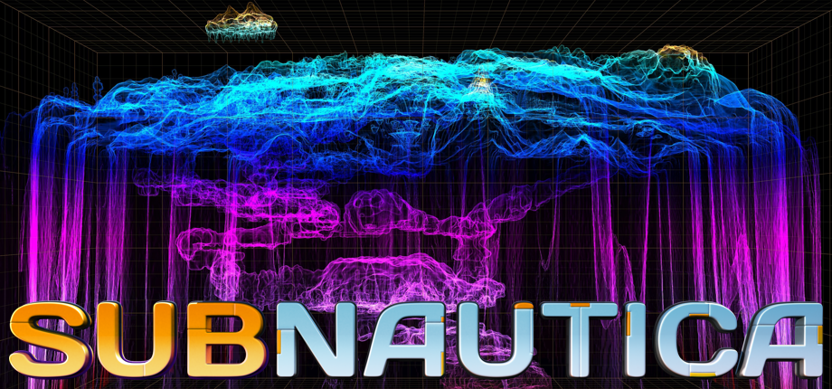 **Subnautica** | [SubmersedVR](https://github.com/Okabintaro/SubmersedVR) by [Okabintaro](https://github.com/Okabintaro) Latest: [0.2.0](https://github.com/Okabintaro/SubmersedVR/releases/latest) (2025-08-17) | PCVR 🚧 beta | [▶ Gamertag VR](https://www.youtube.com/watch?v=XAJC4XRomSA) [▶ Beardo Benjo](https://www.youtube.com/watch?v=m57MU3dw070) |
| 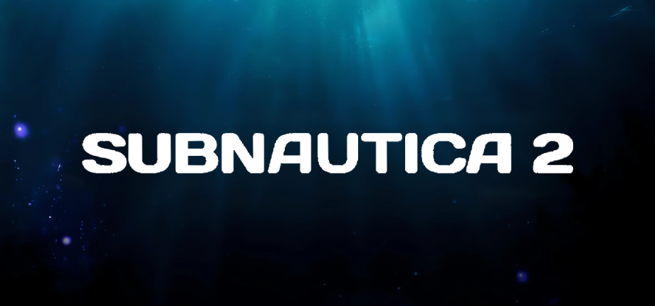 **Subnautica 2** | [Subnautica 2 UEVR](https://github.com/jbusfield/SN2_UEVR) by [jbusfield](https://github.com/jbusfield) Latest: [v1.0.3](https://github.com/jbusfield/SN2_UEVR/releases/latest) (2026-07-08) | PCVR ✅ stable | [▶ LunchAndVR](https://www.youtube.com/watch?v=7cHe25j0N-o) [▶ Beardo Benjo](https://www.youtube.com/watch?v=hbSxbvBot9Y) |
|  **Super Mario 64** | [SM64 Quest VR](https://github.com/heurazy/mario64VRStandalone) by [heurazy](https://github.com/heurazy) Latest: [v1.0.1](https://github.com/heurazy/mario64VRStandalone/releases/latest) (2026-08-07) | Standalone 🧪 alpha | [▶ Beardo Benjo](https://www.youtube.com/watch?v=4lG9Ux9DxwY) |
|  **Super Mario 64** | [sm64coopdx-VR-Standalone (Physics-based)](https://github.com/fulldivegames/sm64coopdx-VR-Standalone-Physics-based) by [fulldivegames](https://github.com/fulldivegames) Latest: [v0.9.21](https://github.com/fulldivegames/sm64coopdx-VR-Standalone-Physics-based/releases/latest) (2026-09-13) | Standalone 🧪 alpha 5 known bugs | [▶ Beardo Benjo](https://www.youtube.com/watch?v=4lG9Ux9DxwY) |
|  **Super Mario Galaxy** | [GalaxyQuest](https://github.com/bigmak94/GalaxyQuest) by [bigmak94](https://github.com/bigmak94) Latest: [v0.1.8](https://github.com/bigmak94/GalaxyQuest/releases/latest) (2026-10-03) | Standalone 🧪 alpha | [▶ Pixelacos VR](https://www.youtube.com/watch?v=d4gvdxW-iVY) [▶ GalaxyQuest](https://www.youtube.com/watch?v=Z35QW5irVcw) |
| 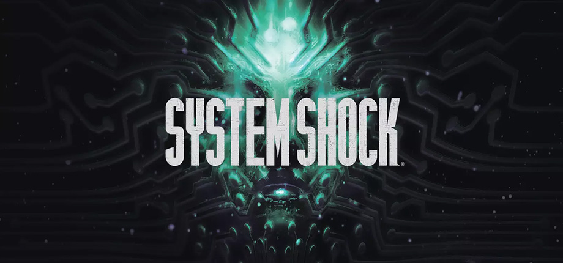 **System Shock (Remake)** | [System Shock Remake UEVR Plugin](https://github.com/Ashok0/SystemShock-UEVR) by [Ashok0](https://github.com/Ashok0) Latest: [v1.01](https://github.com/Ashok0/SystemShock-UEVR/releases/latest) (2024-09-16) | PCVR 💀 abandoned | [▶ Beardo Benjo](https://www.youtube.com/watch?v=gbCEQ9g_j3Y) [▶ gwizdek](https://www.youtube.com/watch?v=Gke3bmS2L-U) |
| 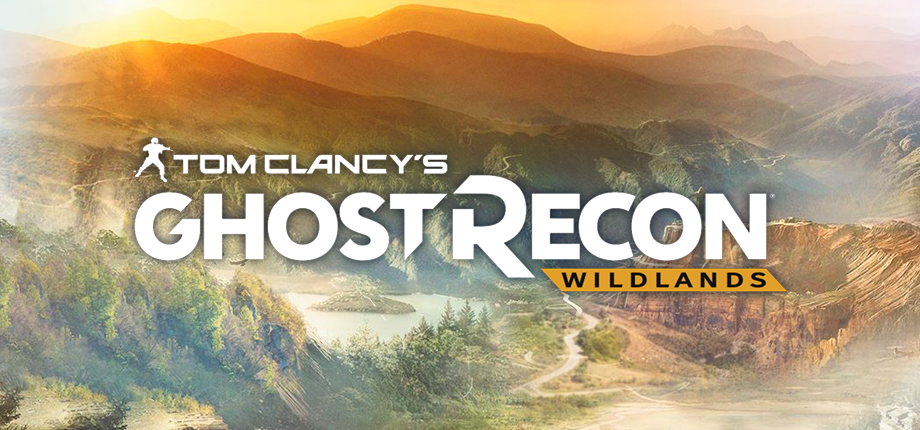 **Tom Clancy's Ghost Recon Wildlands** | [Ghost Recon Wildlands VR (GRW-XR)](https://github.com/Firejumper93/GhostReconWildlandsVR) by [Firejumper93](https://github.com/Firejumper93) Latest: [v0.11.1](https://github.com/Firejumper93/GhostReconWildlandsVR/releases/latest) (2026-09-13) | PCVR 🧪 alpha 2 known bugs | [▶ Geek2](https://www.youtube.com/watch?v=X1PRXN5gVX8) [▶ Geek2](https://www.youtube.com/watch?v=dMRfAHhmbbc) |
|  **Tomb Raider (1996)** | [BeefRaiderXR](https://github.com/Team-Beef-Studios/BeefRaiderXR) by [Team Beef](https://github.com/Team-Beef-Studios) Latest: [1.0.0](https://github.com/Team-Beef-Studios/BeefRaiderXR/releases/latest) (2024-09-29) | Standalone ✅ stable | [▶ UploadVR](https://www.youtube.com/watch?v=DxPmxvf9J7M) [▶ Pixelacos Gameplays](https://www.youtube.com/watch?v=NP2DatOD9IU) |
|  **Ultima IV: Quest of the Avatar** | [ANKH-VR](https://github.com/plaidpants/ANKH-VR) by [plaidpants](https://github.com/plaidpants) Latest: [0.2.15](https://github.com/plaidpants/ANKH-VR/releases/latest) (2026-07-02) | PCVR + Standalone 🚧 beta | [▶ James Surine](https://www.youtube.com/watch?v=kLdYe7H2X_s) [▶ Hoshi82](https://www.youtube.com/watch?v=Z9mnNK967Jo) |
| 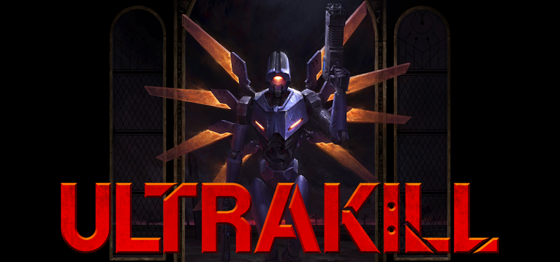 **ULTRAKILL** | [VRTRAKILL](https://github.com/whateverusername0/VRTRAKILL) by [whateverusername0](https://github.com/whateverusername0) Latest: [0.20.2](https://github.com/whateverusername0/VRTRAKILL/releases/latest) (2024-05-25) | PCVR 💀 abandoned 1 known bug | [▶ BamBaeYoh](https://www.youtube.com/watch?v=HxIa0X5eomA) [▶ Gloobium](https://www.youtube.com/watch?v=CUw19XwJ24o) |
| 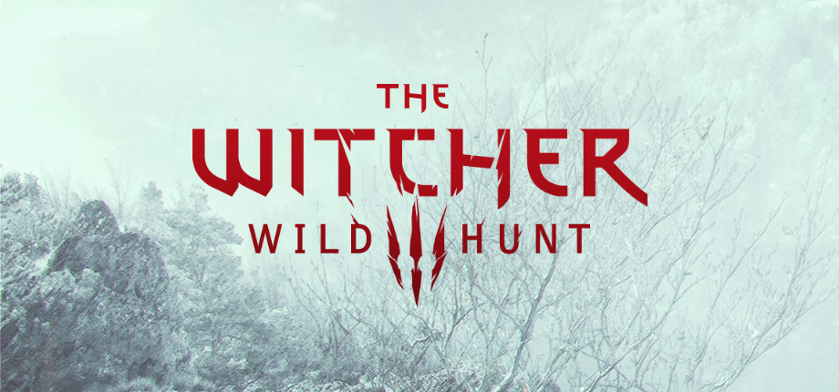 **The Witcher 3: Wild Hunt** | [The Witcher 3 VR](https://github.com/tig3rmast3r/witcher3-vr) by [tig3rmast3r](https://github.com/tig3rmast3r) Latest: [v0.9.8v2](https://github.com/tig3rmast3r/witcher3-vr/releases/latest) (2026-10-04) | PCVR 🧪 alpha 2 known bugs | [▶ NotAGameAddict](https://www.youtube.com/watch?v=ZghPdR9i1D4) [▶ ReaperzVR](https://www.youtube.com/watch?v=owIvBBtChic) |
| 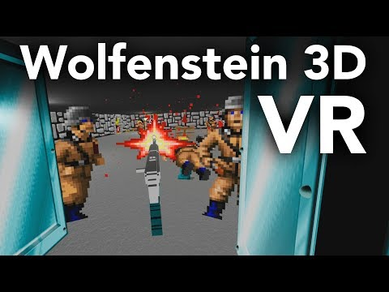 **Wolfenstein 3-D** | [WolfSharp VR](https://benmclean.itch.io/wolfsharp) by Ben McLean Latest: [unversioned](https://benmclean.itch.io/wolfsharp) (2026-07-25) | PCVR 🧪 alpha | [▶ Ben Plays VR](https://www.youtube.com/watch?v=IXfuSlNU5ps) |

<!-- INDEX:END -->

## See also

Other catalogs worth knowing about. They are not affiliated with this one.

- [PCVR Central](https://pcvrcentral.com/): the largest PCVR mod catalog, with quality tiers and a Steam library checker.
- [RototRobot's VR Mods List](https://rototrobot.github.io/VRMods-List/): a long-running curated directory.
- [QuestPorts](https://questports.vercel.app/): standalone Quest ports, with install guides and in-browser install.
- [UEVR Profiles](https://uevr-profiles.com/): per-game UEVR profiles.
- [Flat2VR Discord](https://discord.gg/flat2vr): where most of these ports are announced and supported.

## License

Data and code: [CC0 1.0](LICENSE). Game images keep their owners' rights and are credited in each entry.
